NOTE: This is a work in progress, the pandoc conversion seems to have added some funky layout or text problems. Feel free to make a PR if you want to fix anything.


# FFmpeg For Beginners - Edit Audio & Video Like a Pro for Youtube and Social Media

The entire book released under [Creative Commons Attribution-NonCommercial 4.0 International](./license.md)

## Purchase physical book

Link: https://www.amazon.com/dp/B087GYV15Y


# Contents

## 2nd Edition

Copyright © John Riselvato 2020
Copyright © 3 Slashed Books 2020
All rights reserved

# Table of Contents

[1. What is FFmpeg?](#1-what-is-ffmpeg)   

[2. How to Install FFmpeg on macOS?](#2-how-to-install-ffmpeg-on-macos)

[3. How to Install FFmpeg on Linux?](#3-how-to-install-ffmpeg-on-linux)

[4. How to Install FFmpeg on Windows?](#4-how-to-install-ffmpeg-on-windows)

[5. How to Configure FFmpeg with Extra Dependencies?](#5-how-to-configure-ffmpeg-with-extra-dependencies)

[6. How to Install FFmpeg on a PHP Server?](#6-how-to-install-ffmpeg-on-a-php-server)

[7. How to Use FFmpeg in Various Languages?](#7-how-to-use-ffmpeg-in-various-languages)

[8. How to Check the Installed FFmpeg Version?](#8-how-to-check-the-installed-ffmpeg-version)

[9. What is a Codec? Explained](#9-what-is-a-codec-explained)

[10. What are All the Codecs FFmpeg Supports?](#10-what-are-all-the-codecs-ffmpeg-supports)

[11. What are All the Formats FFmpeg Supports?](#11-what-are-all-the-formats-ffmpeg-supports)

[12. How to Copy a Codec From One File to Another?](#12-how-to-copy-a-codec-from-one-file-to-another)

[13. How to Check the Audio / Video File Information?](#13-how-to-check-the-audio-video-file-information)

[14. How to Use Filters (-vf/-af VS -filter_complex)?](#14-how-to-use-filters--vf-af-vs--filter_complex)

[15. How to Chain Multiple Filters?](#15-how-to-chain-multiple-filters)

[16. How to Use -filter_complex Without Losing Video Quality?](#16-how-to-use--filter_complex-without-losing-video-quality)

[17. What is -map and How is it Used?](#17-what-is--map-and-how-is-it-used)

[18. How to Convert an Entire Directory?](#18-how-to-convert-an-entire-directory)

[19. How to Extract Audio From a Video?](#19-how-to-extract-audio-from-a-video)

[A Note about Audio conversions:](#a-note-about-audio-conversions)

[20. How to Convert Ogg to MP3?](#20-how-to-convert-ogg-to-mp3)

[21. How to Convert FLAC to MP3?](#21-how-to-convert-flac-to-mp3)

[22. How to Convert WAV to MP3?](#22-how-to-convert-wav-to-mp3)

[23. How to Merge Multiple MP3s into One Track?](#23-how-to-merge-multiple-mp3s-into-one-track)

[A Note About Trimming](#a-note-about-trimming)

[24. How to Trim 'x' Seconds From the Start of an Audio Track?](#24-how-to-trim-x-seconds-from-the-start-of-an-audio-track)

[25. How to Trim 'x' Seconds From the End of an Audio Track?](#25-how-to-trim-x-seconds-from-the-end-of-an-audio-track)

[26. How to Trim 'x' Seconds From the Start and End of an Audio Track?](#26-how-to-trim-x-seconds-from-the-start-and-end-of-an-audio-track)

[27. How to Adjust Audio Volume?](#27-how-to-adjust-audio-volume)

[28. How to Crossfade Two Audio Tracks?](#28-how-to-crossfade-two-audio-tracks)

[29. How to Normalize Audio Data?](#29-how-to-normalize-audio-data)

[30. How to Add an Echo to an Audio Track?](#30-how-to-add-an-echo-to-an-audio-track)

[31. How to Change the Tempo of an Audio Track?](#31-how-to-change-the-tempo-of-an-audio-track)

[32. How to Change the Pitch / Sample Rate of an Audio Track?](#32-how-to-change-the-pitch-sample-rate-of-an-audio-track)

[A Note about Pitch, Tempo & Sample Rate](#a-note-about-pitch-tempo-sample-rate)

[33. How to Generate an Audio Tone?](#33-how-to-generate-an-audio-tone)

[34. How to Generate Text to Speech Audio?](#34-how-to-generate-text-to-speech-audio)

[35. How to Add a Low-Pass Filter to an Audio Track?](#35-how-to-add-a-low-pass-filter-to-an-audio-track)

[36. How to Add a High-Pass Filter to an Audio Track?](#36-how-to-add-a-high-pass-filter-to-an-audio-track)

[A Note About Audio only Related Filters](#a-note-about-audio-only-related-filters)

[37. How to Remove Audio From a Video?](#37-how-to-remove-audio-from-a-video)

[38. How to Mix Additional Audio into a Video?](#38-how-to-mix-additional-audio-into-a-video)

[39. How to Replace the Audio on a Video?](#39-how-to-replace-the-audio-on-a-video)

[40. How to Convert MOV to MP4?](#40-how-to-convert-mov-to-mp4)

[41. How to Convert MKV to MP4?](#41-how-to-convert-mkv-to-mp4)

[42. How to Convert AVI to MP4?](#42-how-to-convert-avi-to-mp4)

[43. How to Convert FLV to MP4?](#43-how-to-convert-flv-to-mp4)

[44. How to Convert WebM to MP4?](#44-how-to-convert-webm-to-mp4)

[A Note about Converting to MP4](#a-note-about-converting-to-mp4)


[45. How to Convert MP4 to GIF?](#45-how-to-convert-mp4-to-gif)

[46. How to Compress MP4 and Reduce File Size?](#46-how-to-compress-mp4-and-reduce-file-size)

[47. How to Trim 'x' Seconds From the Start of a Video?](#47-how-to-trim-x-seconds-from-the-start-of-a-video)

[48. How to Trim 'x' Seconds From the End of a Video?](#48-how-to-trim-x-seconds-from-the-end-of-a-video)

[49. How to Trim 'x' Seconds From the Start and End of a Video?](#49-how-to-trim-x-seconds-from-the-start-and-end-of-a-video)

[50. How to Splice a Video into Segments?](#50-how-to-splice-a-video-into-segments)

[51. How to Stitch Segments to One Video?](#51-how-to-stitch-segments-to-one-video)

[52. How to Loop a Section of Video Multiple Times?](#52-how-to-loop-a-section-of-video-multiple-times)

[53. How to Concatenate Multiple Videos?](#53-how-to-concatenate-multiple-videos)

**[Color Editing Filters](#color-editing-filters)**


[54. How to Blend Two Videos Together?](#54-how-to-blend-two-videos-together)

[55. How to Add Color Normalization to a Video?](#55-how-to-add-color-normalization-to-a-video)

[56. How to Add Color Balance to a Video?](#56-how-to-add-color-balance-to-a-video)

[57. How to Edit the Hue of a Video?](#57-how-to-edit-the-hue-of-a-video)

[58. How to Convert a Video to Black and White?](#58-how-to-convert-a-video-to-black-and-white)

[59. How to Edit the Saturation of a Video?](#59-how-to-edit-the-saturation-of-a-video)

[60. How to Invert the Colors of a Video?](#60-how-to-invert-the-colors-of-a-video)

[61. How to RGB Shift a Video?](#61-how-to-rgb-shift-a-video)

[62. How to Apply a Vignette to a Video?](#62-how-to-apply-a-vignette-to-a-video)

[63. How to Remove All Colors Except One From a Video?](#63-how-to-remove-all-colors-except-one-from-a-video)

[64. How to Generate a Color Palette From a Video?](#64-how-to-generate-a-color-palette-from-a-video)

[65. How to Apply a Color Palette to a Video?](#65-how-to-apply-a-color-palette-to-a-video)

**[Sharpening / Blurring Filters](#sharpening-blurring-filters)**


[66. How to Sharpen a Video with Unsharp?](#66-how-to-sharpen-a-video-with-unsharp)

[67. How to Blur a Video with Unsharp?](#67-how-to-blur-a-video-with-unsharp)

[68. How to Blur a Video with Smartblur?](#68-how-to-blur-a-video-with-smartblur)

[69. How to Apply a Gaussian Blur to a Video?](#69-how-to-apply-a-gaussian-blur-to-a-video)

[70. How to Apply a Box Blur to a Video?](#70-how-to-apply-a-box-blur-to-a-video)

[71. How to Apply a Pixelated Effect to a Video?](#71-how-to-apply-a-pixelated-effect-to-a-video)

**[Video Playback Filters](#video-playback-filters)**


[72. How to Adjust the Volume of a Video?](#72-how-to-adjust-the-volume-of-a-video)

[73. How to Slow Down a Video?](#73-how-to-slow-down-a-video)

[74. How to Speed Up a video?](#74-how-to-speed-up-a-video)

[75. How to Reverse a Video?](#75-how-to-reverse-a-video)

[76. How to Crop a Video?](#76-how-to-crop-a-video)

[77. How to Change the Frame Rate of a Video?](#77-how-to-change-the-frame-rate-of-a-video)

[78. How to Change the Resolution of a Video?](#78-how-to-change-the-resolution-of-a-video)

[79. How to Apply Quantization to a Video?](#79-how-to-apply-quantization-to-a-video)

[80. How to Remove Duplicate Frames From a Video?](#80-how-to-remove-duplicate-frames-from-a-video)

**[Video Transformation Filters](#video-transformation-filters)**


[81. How to Stack Multiple Videos Horizontally?](#81-how-to-stack-multiple-videos-horizontally)

[82. How to Stack Multiple Videos Vertically?](#82-how-to-stack-multiple-videos-vertically)

[83. How to Horizontal Flip a Video?](#83-how-to-horizontal-flip-a-video)

[84. How to Vertically Flip a Video ?](#84-how-to-vertically-flip-a-video)

[85. How to Rotate a Video?](#85-how-to-rotate-a-video)

**[Adding Text to Video](#adding-text-to-video)**


[86. How to Extract Subtitles From Video?](#86-how-to-extract-subtitles-from-video)

[87. How to Add Subtitles to a Video?](#87-how-to-add-subtitles-to-a-video)

[88. How to Burn Subtitles Into a Video?](#88-how-to-burn-subtitles-into-a-video)

[89. How to Overlay Custom Text in a Video?](#89-how-to-overlay-custom-text-in-a-video)

**[Image video filters](#image-video-filters)**


[90. How to Add a Transparent Watermark to a Video?](#90-how-to-add-a-transparent-watermark-to-a-video)

[91. How to Create a Slideshow Video From Multiple Images?](#91-how-to-create-a-slideshow-video-from-multiple-images)

[92. How to Extract an Image Frame From a Video at a Specific Time?](#92-how-to-extract-an-image-frame-from-a-video-at-a-specific-time)

[93. How to Add an MP3 to an Image to Create a Video?](#93-how-to-add-an-mp3-to-an-image-to-create-a-video)

[94. How to Convert a Video into a Tile Image?](#94-how-to-convert-a-video-into-a-tile-image)

[95. How to Generate a Picture Waveform from a Video?](#95-how-to-generate-a-picture-waveform-from-a-video)

[96. How to Generate a Solid Colored Video?](#96-how-to-generate-a-solid-colored-video)

**[Advanced Video Filters](#advanced-video-filters)**


[97. How to Datamosh/Glitch a Video?](#97-how-to-datamoshglitch-a-video)

[98. How to Add Various Fades to a Video?](#98-how-to-add-various-fades-to-a-video)

[99. How to Add Noise to a Video?](#99-how-to-add-noise-to-a-video)

[100. How to Apply Static to a Video?](#100-how-to-apply-static-to-a-video)

[101. How to Randomize Frames in a Video?](#101-how-to-randomize-frames-in-a-video)

[102. How to Use Green Screen to Mask a Video Into Another Video?](#102-how-to-use-green-screen-to-mask-a-video-into-another-video)

[A Note about frei0r filters](#a-note-about-frei0r-filters)

[103. How to Use the Frei0r Filters?](#103-how-to-use-the-frei0r-filters)

[104. How to obtain a YouTube Streaming key?](#104-how-to-obtain-a-youtube-streaming-key)

[105. How to Stream a File to YouTube?](#105-how-to-stream-a-file-to-youtube)

[106. How to Stream a Webcam to YouTube?](#106-how-to-stream-a-webcam-to-youtube)

[107. How to Use Filters with Video Streaming?](#107-how-to-use-filters-with-video-streaming)

[108. How to Fix the 'width/height not divisible by 2' Error?](#108-how-to-fix-the-widthheight-not-divisible-by-2-error)

[109. How to Fix the '\...was expected to have exactly 1 input and 1 output. However, it had \>1 input(s) and 1 output(s)' Error?](#109-how-to-fix-the-...was-expected-to-have-exactly-1-input-and-1-output.-however-it-had-1-inputs-and-1-outputs-error)

[110. How to Fix the 'Cannot connect audio filter to non audio input' Error?](#110-how-to-fix-the-cannot-connect-audio-filter-to-non-audio-input-error)

[111. How to Fix the 'Cannot connect video filter to audio input' Error?](#111-how-to-fix-the-cannot-connect-video-filter-to-audio-input-error)

[112. How to Fix the 'No such filter: x' Error?](#112-how-to-fix-the-no-such-filter-x-error)

## An Introduction to FFmpeg

*FFmpeg For Beginners Edit Audio & Video Like a Pro for Youtube and
Social Media* is the ultimate FFmpeg programmer's book for users at any
level. Although readers at the novice level can gracefully learn FFmpeg,
upon completing this book you'll graduate to an upper-intermediate skill
level.

## History

FFmpeg is a free and open-source multimedia framework for decoding,
encode, transcoding, muxing, demuxing, streaming, filtering, editing and
playback primarily for video and audio streams. FFmpeg is accessible via
the command-line across most operating systems and is developed in C and
Assembly.

The project was originally developed by Fabrice Bellard in December of
2000 and is currently maintained by the open-source FFmpeg community.
Since it's initial release on GitHub it has had almost 100,000 commits
to the repository and over 300 releases.

Its current license is LGPL 2.1+, GPL 2+ and if combined with software
with a license FFmpeg is incompatible with GPL.

FFmpeg can be found in projects used by Facebook, YouTube, Apple, TV
broadcast companies and so much more. In the world of digital media,
FFmpeg is growing in popularity every year. At any given time most
technology recruiting / job posting websites are constantly looking for
FFmpeg developers.

If you're a hobby programmer and active on social media, FFmpeg can take
boring photos or videos and turn them into elite tier experiences. Stand
out from the crowd and use your FFmpeg skills to enhance your digital
social status.

## Specification

This book recommends that FFmpeg *version 4.2.2+* is used with macOS or
Linux/GNU operating systems as all examples here require *Bash*.
Although FFmpeg is cross platform, Windows users may have to follow
alternative practices not covered in this book.

## Contents

This book is divided into two major sections; Audio and Video. This
allows for the reader to advance their understanding gradually if read
in sequence but as this book is in a question answer format, it can also
be used as a quick reference manual. The following topics are covered:

-   History

-   Installation

-   Understanding the Basics of FFmpeg

-   Basic Audio Conversions

-   Audio Duration Editing

-   Top Audio Filters

-   Basic video conversions

-   Video Timeline Editing

-   Top Video Filters

-   Streaming

-   Common Errors

-   Resources

Upon completion, you'll have an intermediate understanding of
FFmpeg with plenty of new tricks to advance your career or apply to
social media. Before starting the programming, let's get into how to use
it in this book.

## Overview of Features

FFmpeg provides the following features:

1.  Decoding - the ability to decode a multimedia stream

2.  Encoding - the ability to encode a multimedia stream

3.  Transcoding - the ability to take one format and reformat to another

4.  Muxing - the ability to combine audio and video into a single data
> stream.

5.  Demuxing - the ability to split a data stream into multiple formats
> (audio, video, subtitles)

6.  Filtering - the ability to apply complex algorithms to video or
> audio streams

7.  Streaming - the ability to stream data in real time from a host to a
> client

8.  Playback - the ability to play a video from terminal with ffplay

All of which are covered in this book.

## FFmpeg Syntax

FFmpeg at its core is a command line program for manipulating multimedia
files. Commands are typed in a terminal/console and the output is stored
in the specified file path.

In this book, \$ indicates a blank line in the terminal/console which
commands are typed and run from.

The standard command syntax for FFmpeg is as follows:

```
$ ffmpeg [input] [options & arguments] [output]
```

Bash can execute FFmpeg commands from a terminal or from a file but this
book focuses on using command line one-liners to complete most actions.

FFmpeg also has a built-in player called ffplay. This tool allows for
script testing or playback. Here's an example of playback using ffplay:

```
$ ffplay input.mp4
```

Here's an example of ffplay used to test a filter:

```
$ ffplay -i input.mp4 -vf "negate"
```

This is an additional feature of FFmpeg but not a major focus in this
book.

## Options and Arguments

The options and arguments in FFmpeg are the basis for converting
videos/audio formats, applying filters and other various forms of
manipulation. Options are FFmpeg commands that require arguments to
perform an action, while arguments are the values passed inside a
command such as input, output, filters, variables and other forms of
data to complete an action.

**Tip:** Throughout this book the words argument and parameter are used
interchangeably. Options and commands are also used interchangeably.

## Book Conventions

Different from most programming books, *FFmpeg For Beginners* aims to
quickly answer the top FFmpeg questions while introducing the main
concept to be expanded on. Thus, the book uses individual questions as
the header of each example. The index in the back of the book has a list
of key terms that make learning a specific task easier.

Filenames, command names and inline examples are shown in the Consolas
font. Inline examples start with \$ to indicate the start of a bash
command and are highlighted in a mono-blue theme.

Placeholder input/output or variables are presented with square brackets
\[value\] where default values are not defined or a definition is
required.

Special notes are highlighted in **bold** with the word **Tip**.
Commands with large amounts of customization may refer to external
documentation underlined in a [hyperlink blue]. Ebook
readers can click these hyperlinks for external access of said
documentation.

Throughout the book, a video of a Tokyo metro station is used as the
primary file described as input.mp4 or input1.mp4. If a second video is
required, the file input2.mp4 is used and contains a video of a busy
road.

When images are used to provide a better understanding of the output,
figure names are provided in relation to the question number. For
example, Question 1 has figure 1.0 for the first image with figure 1.1
to follow.

If you have any issues or questions while using this book, feel free to
contact me on Twitter:
[https://twitter.com/ffmpegtutorials](https://twitter.com/ffmpegtutorials)

**Tip:** Every script in this book is available for free on my website:
[http://johnriselvato.com/tag/ffmpeg/](http://johnriselvato.com/tag/ffmpeg/)

## Standard Video / Audio File Syntax

FFmpeg supports almost an unlimited amount of video and audio formats.
Audio default to using MP3 for audio and MP4 for video. Don't worry,
this book covers how to convert the most common audio and video formats
to MP3 and MP4, but most if not all commands in this book work with any
desired format with proper encoding. Standard filenames are as followed:

-   Audio input: input.mp3

-   Audio output: output.mp3

-   Video input: input.mp4/input1.mp4/input2.mp4

-   Video output: output.mp4

In instances where two FFmpeg commands are required to complete a task,
the output of the first command takes the name of the action and with
the final output file resulting in output.mp3/output.mp4. For example:

```
$ ffmpeg -i input.mp4 [blur argument] blur.mp4
$ ffmpeg -i blur.mp4 [color correction argument] output.mp4
```


Installation

This section covers the most common installation questions for FFmpeg.
Covering the installation on macOS, Linux/GNU and Windows initially.
FFmpeg also works well with PHP, and a few other programming languages.
Getting started with these topics gets you working with FFmpeg as
quickly as possible.

Let the answering of questions begin!

## 1. What is FFmpeg?

FFmpeg is the most well known multimedia framework for decoding, encode,
transcoding, muxing, demuxing, streaming, filtering, editing and playing
almost every video and audio format ever created. FFmpeg is not limited
to open source formats but even those maintained by corporate entities.

FFmpeg is built with multiple multimedia libraries which are available
free of charge and at its core used from the command line tool. FFmpeg
is open source and cross platform, so running it on macOS, Linux,
Windows, Android, iOS, etc is possible with little effort.

Most people use FFmpeg to convert one file format to another. Those with
a little creative spark use FFmpeg to create complex audio or visual
edits on the fly or even build entire software programs out of it. In
this book you'll learn how to take this massive multimedia framework and
master it.

## 2. How to Install FFmpeg on macOS?

Installing FFmpeg on macOS is simple for users with *Homebrew*
installed. Homebrew is the package manager macOS as always needed but
has yet to have. Think of it as an equivalent to apt-get on linux.

To quickly install Homebrew run the following:

```
$ /bin/bash -c "$(curl -fsSL
https://raw.githubusercontent.com/Homebrew/install/master/install.sh)"
```

**Tip:** For more information on homebrew or installing homebrew, visit:
[https://brew.sh](https://brew.sh)

The FFmpeg installation command is as follows:

```
$ brew install ffmpeg
```

**Tip:** If additional libraries are required for an FFmpeg build,
reference question 5, *"How to Configure FFmpeg with Extra
Dependencies?"*.

## 3. How to Install FFmpeg on Linux?

On Ubuntu or Debian based Linux operating systems with apt-get
installed, FFmpeg installation is easy:

```
$ sudo apt-get update
$ sudo apt-get install ffmpeg
```

This installs the latest FFmpeg package but some Linux users may want to
install from source. FFmpeg requires compilation and installation of
various codecs and libraries not bundled with FFmpeg source code, thus
out of scope for this book.

If installation from source is required, visit the following FFmpeg wiki
page:

[https://trac.ffmpeg.org/wiki/CompilationGuide/Ubuntu](https://trac.ffmpeg.org/wiki/CompilationGuide/Ubuntu)

## 4. How to Install FFmpeg on Windows?

Although this book may cover functionality that does not work out of the
box on the windows operating system, FFmpeg is cross-platform and does
everything macOS and Linux builds can do.

Installation of FFmpeg on Windows is more involved as Windows doesn't
natively have a package manager. The good news is the people over at
*Zeranoe* have provided an FFmpeg build for Windows 64-bit and 32-bit.
Visit the following for more instructions:
[https://ffmpeg.zeranoe.com/builds/](https://ffmpeg.zeranoe.com/builds/)

FFmpeg requires additional configuration on Windows. Below is the
general requirement to install FFmpeg but installation may vary:

1.  **Extract** the FFmpeg build to C:\\

2.  **Rename** the build folder to FFmpeg

3.  Navigate to Environment Variables by doing a Windows **search** for:
> *Edit the system environment variables*

4.  In the Environment Variables window, select the Variable Path and
> click **New**

5.  Type the path of the FFmpeg folder C:\\FFmpeg\\bin\\ and click
> **OK** to apply changes

Upon installation, FFmpeg is accessible via the *command prompt*. Typing
ffmpeg and pressing enter to verify if the installation has been
successful.

If the command prompt indicates that FFmpeg is not recognized double
check to ensure the FFmpeg folder is referenced in Environment Variables
properly.

## 5. How to Configure FFmpeg with Extra Dependencies?

Build dependencies are great additions to FFmpeg that can make the
program even more powerful. These dependencies link to 3rd party tools
that extend functionality or even simplify some processes. In this book
there are a couple of audio/video filters that require extra installed
dependencies. Installation is as follows:

**macOS**

As of Early 2020, macOS + homebrew install has disabled native
dependencies support. Luckily, thanks to a discussion on GitHub the
current workaround is as follows (install all available dependencies):

```
+-----------------------------------------------------------------------+
| $ brew uninstall --force --ignore-dependencies ffmpeg             |
| $ brew install chromaprint amiaopensource/amiaos/decklinksdk        |
| $ brew tap homebrew-ffmpeg/ffmpeg                                    |
|                                                                       |
| $ brew install ffmpeg                                               |
| $ brew upgrade homebrew-ffmpeg/ffmpeg/ffmpeg $(brew options         |
| homebrew-ffmpeg/ffmpeg/ffmpeg | grep -vE 's' | grep --         |
| '--with-' | grep -vi chromaprint | tr 'n' ' ')             |
+=======================================================================+
+-----------------------------------------------------------------------+
```

Source:
[https://gist.github.com/Piasy/b5dfd5c048eb69d1b91719988c0325d8](https://gist.github.com/Piasy/b5dfd5c048eb69d1b91719988c0325d8)

**Linux**

Linux users who want to configure extra dependencies are required to
install from source, reference question 3, "How to Install FFmpeg on
Linux?".

Here's an example of how to install dependencies provided by the FFmpeg
wiki:

```
$ cd ~/ffmpeg_sources && 
wget -O ffmpeg-snapshot.tar.bz2
https://ffmpeg.org/releases/ffmpeg-snapshot.tar.bz2 && 
tar xjvf ffmpeg-snapshot.tar.bz2 && 
cd ffmpeg && 
PATH="$HOME/bin:$PATH"
PKG_CONFIG_PATH="$HOME/ffmpeg_build/lib/pkgconfig" ./configure 
--prefix="$HOME/ffmpeg_build" 
--pkg-config-flags="--static" 
--extra-cflags="-I$HOME/ffmpeg_build/include" 
--extra-ldflags="-L$HOME/ffmpeg_build/lib" 
--extra-libs="-lpthread -lm" 
--bindir="$HOME/bin" 
--enable-gpl 
--enable-libaom 
--enable-libass 
--enable-libfdk-aac 
--enable-libfreetype 
--enable-libmp3lame 
--enable-libopus 
--enable-libvorbis 
--enable-libvpx 
--enable-libx264 
--enable-libx265 
--enable-nonfree && 
PATH="$HOME/bin:$PATH" make && 
make install && 
hash -r
```

Source:
[https://trac.ffmpeg.org/wiki/CompilationGuide/Ubuntu](https://trac.ffmpeg.org/wiki/CompilationGuide/Ubuntu)

## 6. How to Install FFmpeg on a PHP Server?

Now that FFmpeg is installed on your specific operating system, you can
use FFmpeg in the *command line* or graduate to using it on your
webserver with PHP. The connection to PHP makes FFmpeg very dynamic and
useful for generating audio or videos on a server or to be sent to a
client.

Once FFmpeg is installed on the server, using PHPs' shell_exec() to
access FFmpeg is as easy as using the command line, for example:

```
echo shell_exec("ffmpeg -i input.mp4 output.mp4 &");
```

There is a PHP library, *PHP-FFMpeg*, available if this method is too
simplistic but it requires additional set up not covered in this book.

For more information visit the PHP-FFMpeg GitHub at:
[https://github.com/PHP-FFMpeg/PHP-FFMpeg](https://github.com/PHP-FFMpeg/PHP-FFMpeg)

## 7. How to Use FFmpeg in Various Languages?

Command line one-liners are great for quick and one-off FFmpeg
experiences but sooner or later the need for a custom application is
required for efficiency. FFmpeg can be used with almost any programming
language with little effort. Some languages might even have libraries of
their own to extend FFmpeg natively. Below are a few examples of various
languages using FFmpeg:

**Python/FFmpy**

FFmpeg is easily accessible using os.system in Python, as seen below:

```
import os
os.system("ffmpeg -i input.mp4 output.mp3")
```

But Python also has a 3rd party library *ffmpy*, which has its own
syntax and way of using FFmpeg. In this example an MP4 is covered to
MP3:

```
import ffmpy
ff = ffmpy.FFmpeg(
... inputs={'input.mp4': None},
... outputs={'output.mp3': None}
... )
ff.run()
```

More information:
[https://pypi.org/project/ffmpy/](https://pypi.org/project/ffmpy/)

**Bash/Shell**

Although most examples in this book are *Bash* one-liners, it is
beneficial to know how to run FFmpeg from a Bash / Shell script. In this
example, the script converts all MP4 files in a folder to MP3
(script.sh):

```
for i in *.mp4; do
OUTPUT=${i%.mp4}
echo $OUTPUT
ffmpeg -i "$i" $OUTPUT.mp3
done
```

**Ruby/Streamio**

Ruby also has its own FFmpeg library called *Streamio*. In this example,
a MOV file is converted to MP4:

```
+-----------------------------------------------------------------------+
| require 'streamio-ffmpeg'                                           |
|                                                                       |
| input = FFmpeg::Movie.new("path/to/input.mov")                     |
| output.transcode("movie.mp4") # Output to mp4                      |
+=======================================================================+
+-----------------------------------------------------------------------+
```

More information:
[https://github.com/streamio/streamio-ffmpeg](https://github.com/streamio/streamio-ffmpeg)

As mentioned earlier, FFmpeg is cross-platform and open source ports are
available in almost every language or platform. Although not covered in
this book, this also includes iOS and Android.

Are you using FFmpeg in a language or platform this book didn't cover?
Share your project with me on Twitter: \@ffmpegtutorials

## 8. How to Check the Installed FFmpeg Version?

At this point FFmpeg should be installed on your operating system of
choice and ready for use. To double check installation run the following
command:

```
$ ffmpeg -version
```

The output details the FFmpeg version as well as the various
configurations enabled and disabled and which additional codecs are
installed. Below is the recommended setup for this book:

```
$ ffmpeg -version
ffmpeg version 4.2.2 Copyright (c) 2000-2019 the FFmpeg developers
built with Apple clang version 11.0.0 (clang-1100.0.33.17)
configuration: --prefix=/usr/local/Cellar/ffmpeg/4.2.2_2
--enable-shared --enable-pthreads --enable-version3
--enable-avresample --cc=clang --host-cflags= --host-ldflags=
--enable-ffplay --enable-gnutls --enable-gpl --enable-libaom
--enable-libbluray --enable-libmp3lame --enable-libopus
--enable-librubberband --enable-libsnappy --enable-libtesseract
--enable-libtheora --enable-libvidstab --enable-libvorbis
--enable-libvpx --enable-libwebp --enable-libx264 --enable-libx265
--enable-libxvid --enable-lzma --enable-libfontconfig
--enable-libfreetype --enable-frei0r --enable-libass
--enable-libopencore-amrnb --enable-libopencore-amrwb
--enable-libflite --enable-libzvbi --enable-libopenjpeg
--enable-librtmp --enable-libspeex --enable-libsoxr
--enable-videotoolbox --disable-libjack --disable-indev=jack
libavutil 56. 31.100 / 56. 31.100
libavcodec 58. 54.100 / 58. 54.100
libavformat 58. 29.100 / 58. 29.100
libavdevice 58. 8.100 / 58. 8.100
libavfilter 7. 57.100 / 7. 57.100
libavresample 4. 0. 0 / 4. 0. 0
libswscale 5. 5.100 / 5. 5.100
libswresample 3. 5.100 / 3. 5.100
libpostproc 55. 5.100 / 55. 5.100
```

**Tip:** It is suggested to use FFmpeg *version 4.2.2* or higher.

With FFmpeg installed, configured and ready to run it's time to learn
the basics of FFmpeg. Although this book covers the top 112 most
searched questions for FFmpeg, the functionality of this application is
limitless. Next, let's explore the world of audio editing with FFmpeg!


Understanding the Basics of FFmpeg

This section quickly catches you up to speed on the foundational
building blocks of FFmpeg and key concepts. Here you'll learn about
codecs & formats, general filter syntax and how to use FFmpeg at the
most basic level. This is the most important section of the book, as
without this knowledge chances are you're using FFmpeg blindly.

## 9. What is a Codec? Explained

FFmpeg has hundreds of different codecs to edit with, convert to and
play from. In your journey to mastering FFmpeg you'll face the word
codec so often that not understanding what one is, is a disservice to
yourself.

Wikipedia explains a codec as:

> "\... a device or computer program which encodes or decodes a digital
> data stream or signal. A coder encodes a data stream or a signal for
> transmission or storage, possibly in encrypted form, and the decoder
> function reverses the encoding for playback or editing."

This book focuses on the MP3/AAC codecs for audio and the H.264 codec
for video. These are the most popular codecs for modern software and
websites making them the obvious choice. For example, it's much easier
to post an MP4 file with the H.264 codec to Instagram and Twitter than
it is to upload an Apple MOV video.

**Tip:** Codecs are not the container that makes up an MP4 but the
encoded data to allow MP4 files to be understood by software.

**Tip:** Refer to question 11, "*What are All the Formats FFmpeg
Supports?"*, for more information about format containers.

## 10. What are All the Codecs FFmpeg Supports?

Since *codecs* are the backbone of FFmpeg, it is beneficial to know how
to access the full list of supported codecs. The command is as follows:

```
$ ffmpeg -codecs
```

The output from this command shows hundreds of codecs for both audio and
video. For the full list of supported codecs, refer to the *List of
Codecs* section in the back of this book.

**Tip:** The [libx264 / H.264 video codec for MP4 files are the default
in this book.]{.mark}

[**Tip:** The MP3/AAC audio codecs for audio files are the default in
this book.]{.mark}

## 11. What are All the Formats FFmpeg Supports?

Unlike codecs, *formats* are the digital input/output containers FFmpeg
and other software use to identify the type of file.

While an MP4 is the extension, formats are the encoded video and audio
container. For example, an MP4 file may contain one of the following
audio codecs: ACC, AC3, ALS, MP3, or ACC.

Selecting the correct codec depends on the output format. This is not an
automatic result but a manual selection through being familiar with the
supported formats and their codecs. For a full list type:

```
$ ffmpeg -formats
```

The output of this command results in a list detailing hundreds of
FFmpeg supported formats. For the full list of supported formats, refer
to the *List of Formats* section in the back of this book.

## 12. How to Copy a Codec From One File to Another?

Copying a codec from one file to another is easy and convenient. This is
useful as a convenience method when the output uses the same codec as
the input but in most cases the copying may be omitted.

Here is an example of a MOV file being converted to an MP4 with both
audio and video codecs being copied:

```
$ ffmpeg -i input.mov -c:v copy -c:a copy output.mp4
```

This is the first syntax based command seen in this book, let's break it
down. The -c:v (or -vcodec) sets the video codec, while -c:a (or
-acodec) sets the audio codec. Adding the value copy after each results
in FFmpeg using and copying the codec from the input file.

It is common to see on programming forums, such as Stack Overflow,
examples where the author has copied the codec from one format type to
another. More often than not, this is risky but due to programs like
VLC, playback isn't halted regardless of format type + codec
combinations.

In this example, an AVI file is being converted to an MP4 but there is a
risk in copying the codecs:

```
$ ffmpeg -i input.avi -vcodec copy -acodec copy output.mp4
```

The reason for concern is the AVI format supports a wide range of
codecs, DivX, Xvid, H.264, and MPEG-4 to name a few. Whereas an MP4 does
not natively support DivX, Xvid or other codecs. So copying video codecs
blindly may result in a faulty playback.

**Tip:** VLC might play an MP4 with a DivX codec but uploading to
Instagram can not because it does not have a decoder for DivX playback.

## 13. How to Check the Audio / Video File Information?

Now that the importance of knowing which codecs a file format should
conform to, let's investigate the information inside an input file. The
command is as follows:

```
$ ffmpeg -i input.mp3
ffmpeg version 4.2.2 Copyright (c) 2000-2019 the FFmpeg developers
built with Apple clang version 11.0.0 (clang-1100.0.33.17)
configuration: --prefix=/usr/local/Cellar/ffmpeg/4.2.2_2
--enable-shared --enable-pthreads --enable-version3
--enable-avresample --cc=clang --host-cflags= --host-ldflags=
--enable-ffplay --enable-gnutls --enable-gpl --enable-libaom
--enable-libbluray --enable-libmp3lame --enable-libopus
--enable-librubberband --enable-libsnappy --enable-libtesseract
--enable-libtheora --enable-libvidstab --enable-libvorbis
--enable-libvpx --enable-libwebp --enable-libx264 --enable-libx265
--enable-libxvid --enable-lzma --enable-libfontconfig
--enable-libfreetype --enable-frei0r --enable-libass
--enable-libopencore-amrnb --enable-libopencore-amrwb
--enable-libopenjpeg --enable-librtmp --enable-libspeex
--enable-libsoxr --enable-videotoolbox --disable-libjack
--disable-indev=jack
libavutil 56. 31.100 / 56. 31.100
libavcodec 58. 54.100 / 58. 54.100
libavformat 58. 29.100 / 58. 29.100
libavdevice 58. 8.100 / 58. 8.100
libavfilter 7. 57.100 / 7. 57.100
libavresample 4. 0. 0 / 4. 0. 0
libswscale 5. 5.100 / 5. 5.100
libswresample 3. 5.100 / 3. 5.100
libpostproc 55. 5.100 / 55. 5.100
Input #0, mp3, from 'input.mp3':
Metadata:
title : 1989 MAZDA FAMILIA // Car
artist : テレビCM
track : 16
album : Visual Signals
date : 2020
encoder : Lavf58.29.100
Duration: 00:00:16.58, start: 0.023021, bitrate: 128 kb/s
Stream #0:0: Audio: mp3, 48000 Hz, stereo, fltp, 128 kb/s
Metadata:
encoder : Lavc58.54
Side data:
replaygain: track gain - 13.100000, track peak - unknown, album gain -
unknown, album peak - unknown,
At least one output file must be specified
```

After the FFmpeg version and configuration information the Input section
details information like metadata, duration, encoding and more. In the
above example it can be noted that input.mp3 is indeed an MP3 encoded
with *Lavc/Lavf*.

## 14. How to Use Filters (-vf/-af VS -filter_complex)?

Converting between one file format to another is extremely useful and
might be all one might use FFmpeg for but where the real fun begins is
in the filters. Filters are used to manipulate audio and video with the
*libavfilter* library. These range from editing the color to adding
complex algorithms to improve output.

A filter can apply a single change to an input file or multiple changes
to multiple input & output files or anything in between. Filters follow
a sequential order as written in the command.

The options -vf / -af (video filter / audio filter) are used for simple
filtergraphs (one input, one output), and -filter_complex is used for
complex filtergraphs (one or more inputs, one or more outputs). Using
-filter_complex omits the specification of the multimedia type as both
video and audio filters can be used at the same time.

Below is an example of reversing the input video and audio with both
syntax types.

An example using -vf / -af syntax:

```
$ ffmpeg -i input.mp4 -vf "reverse" -af "areverse" output.mp4
```

An example using -filter_complex syntax:

```
$ ffmpeg -i input.mp4 -filter_complex
"[0:v]reverse;[0:a]areverse" output.mp4
```

The -filter_complex option isn't only used when chaining audio and video
manipulation. -filter_complex can be used when multiple inputs are
required or when temporary streams are created.

**Tip:** The \[0:v\] and \[0:a\] syntax indicates a way to access the
input video and audio. See question 17, *"What is -map and How is it
Used?"*, for more details.

**Tip:** For more information see question 15, *"How to Chain Multiple
Filters?"*

Lastly FFmpeg does have streaming capabilities and filters can be
applied and changed at runtime. For more information see question 112,
*"How to Use Filters with Video Streaming?"*.

## 15. How to Chain Multiple Filters?

Using FFmpeg scripts a single filter at a time might get the job done
but at times applying multiple filters is required. It is possible to
apply one filter at a time constantly referencing the last output file
but ideally chains are used to efficiently apply multiple filters.

There are two types of filter chaining in FFmpeg; *Linear chains* and
*distinct linear chains*. Linear chains are separated by commas while
distinct linear chains are separated by semicolons.

*Linear chains* are filters applied to an input or temporary stream but
do not require creating additional temporary streams before creating the
output file.

Below is an example of a linear chain horizontally flipping a video and
then inverting the colors:

```
$ ffmpeg -i input.mp4 -vf "hflip,negate" output.mp4
```

*Distinct linear* chains use secondary inputs or temporary streams
before creating the final output. In this example the input is split
into temporary streams. The second stream is reversed and finally the
two temporary streams are merged together. Resulting in an audio
playback with both forward and reversed playing at the same time:

```
$ ffmpeg -i input.mp3 -filter_complex "asplit [main][tmp];
[tmp]areverse[new]; [new][main]amix=inputs=2[out]" -map
"[out]" output.mp3
```

Don't worry if the above code looks intimidating, distinct linear chains
are easier to understand the more you use them.

**Tip:** See question 17, *"What is -map and How is it Used?"*, for more
details about distinct linear chains and mapping.

In addition to chaining, some filters may take a list of parameters
which might look like chaining in itself. To distinguish between
chaining and a parameter list the filter starts with the name followed
by an equal sign followed by additional parameters that are separated by
a colon. This example of multiple filter parameters adds two seconds to
the end of an audio file:

```
$ ffmpeg -i input.mp3 -af "apad=packet_size=4096:pad_dur=2"
output.mp3
```

Where apad is the padding audio filter that has the parameters packet
size and pad duration.

**Tip:** It is important to use -af or -filter_compex when applying an
audio filter. Using -vf (video filter) outputs a new file but does not
apply the apad filter.

**Tip:** Most audio filters start with an 'a' (for audio) followed by
the name of the filter. Video and audio filters may have the same name
and the suffix 'a' indicates the filter is specific to audio.

## 16. How to Use -filter_complex Without Losing Video Quality?

This is one of the most asked questions about FFmpeg and for a good
reason. By default automatic compression is added depending on the
filter. This is usually done to perform the filter quicker as the higher
the quality, the longer the command takes for completion.

Compression is avoided by using a recommended codec and setting quality.
It is recommended that the *H.264* encoder, seen as libx264, is used
with most video formats. This assumes that your FFmpeg installation is
configured with \--enable-libx264.

The H.264 codec can be set as seen in the example below:

```
$ ffmpeg -i input.mp4 -c:v libx264 output.mp4
```

Setting the *constant rate factor* (-crf) is another recommended
compression technique. This is an encoding mode for some codecs to
adjust file data rate up or down which in return affects the quality
level. Lossless output has a value of 0 as the lower the number the
higher the quality but larger the file size. The default value is 23
while 51 is the lowest quality. According to the FFmpeg documentation,
values between 17-28 are "virtually lossless" visually but not
technically. Here's an example of using -crf:

```
$ ffmpeg -i input.mp4 -c:v libx264 -crf 28 output.mp4
```

In addition to setting the codec and constant rate factor, selecting a
preset can also increase quality but increases the file size. Setting
the preset determines the encoding speed and compression ratio. The
slower the preset the longer the computation time. The presets are as
follows:

-   ultrafast

-   superfast

-   veryfast

-   faster

-   fast

-   medium -- default

-   slow

-   slower

-   veryslow

For the highest video quality with all 3 settings, use the following
command:

```
$ ffmpeg -i input.mp4 -c:v libx264 -crf 0 -preset veryslow output.mp4
```

**Tip:** If a filter is causing quality to degrade, add these options
between the input and output.

**Tip:** Although the question states -filter_complex this can also be
applied to -vf (video filter).

## 17. What is -map and How is it Used?

The -map functionality is an advanced feature that allows the user to
specify the input audio or video for the output file. In addition,
virtual streams may be created to apply complex manipulations that can
be accessed with -map.

Normally, a map isn't required to set an output as the audio and video
are known. Here an input is duplicated to an output and FFmpeg knows to
use the same audio and video for the final result:

```
$ ffmpeg -i input.mp4 output.mp4
```

If this was written using -map the example would like this:

```
$ ffmpeg -i input.mp4 -map 0:v -map 0:a output.mp4
```

Here the map of 0:v is the video of input 1 (0 index) and 0:a is the
audio of input 1 (0 index).

In examples where multiple inputs are available, the use of -map
specifies which stream is included in the output. In the example below,
the 0:v is the input1.mp4 video and 1:a is the input2.mp4 audio. This
results in a new output with the video from the first input and the
audio from the second:

```
$ ffmpeg -i input1.mp4 -i input2.mp4 -map 0:v -map 1:a output.mp4
```

In the case of using a filter with a script of two inputs, the specific
input must be set. The syntax is a little different in this situation as
the filter must know which input uses the filter.

In this example, the output video is from input1.mp4 and a filter is
used on the audio of input2.mp4.

The volume of the audio had an increased volume of 10dB because that
second input was specified to have the filter applied to it:

```
$ ffmpeg -i input1.mp4 -i input2.mp4 -filter_complex
"[1:a]volume=10dB[new_audio]" -map 0:v -map [new_audio]:a
output.mp4
```

The volume filter is applied to \[1:a\], the audio from input2.mp4, and
a new temporary stream, \[new_audio\], must be created for -map to set
the new audio in the output. Accessing the audio from \[new_audio\]
follows the same pattern with the \[new_audio\]:a syntax.

If an input has multiple audio sources as seen in MKV files, the access
to a specific audio channel syntax is as seen below:

```
$ ffmpeg -i input.mkv -map 0:v -map 0:a:1 output.mp4
```

The additional syntax adds a third variable for the audio source. If the
above MKV had 2 audio sources, 0:a:0 or 0:a:1 could be used to select
the appropriate source. This is useful for when an MKV has multiple
language tracks but the output only needs one.

In addition to creating a temporary stream, it can also have a filter
applied to it through chaining. Here the same concept from the last
example, except the \[new_audio\] stream has an areverse filter applied
to it:

```
$ ffmpeg -i input1.mp4 -i input2.mp4 -filter_complex
"[1:a]volume=50dB[new_audio];
[new_audio]areverse[reversed_audio]" -map 0:v -map
[reversed_audio]:a -shortest output.mp4
```

Here a new audio stream, \[reversed_audio\], is created and set for the
output. The final results being video from input1.mp4 with audio from
input2.mp4 with 10dB higher volume and reverse is now complete.

The syntax of -map accesses to a stream\'s audio and video is very
similar to dictionaries in the Swift programming language. A dictionary
has a key and value, \[key:value\], and in FFmpeg the *key* is the
index/name while the *value* is either an audio or video source.

**Tip:** If the output requires video and audio both must be mapped.

## 18. How to Convert an Entire Directory?

Before exploring how to use all the amazing and powerful filters, let's
first learn one more useful trick; converting an entire directory.
Whether it's to convert an entire folder or apply a filter to multiple
files, cycling through files is bound to come up in any workflow.

In the example below, this one-liner converts all WAV files in a folder
to MP3:

```
$ **for** i **in** *.wav; **do** ffmpeg -i "$i" "${i%.*}.mp3";
**done**
```

This keeps a copy of the input WAV file while additionally adding a new
MP3 file to the same folder.

All FFmpeg commands can use this same format but at some point a shell
script might be required to complete complex filtering. See question 7,
*"How to Use FFmpeg in Various Languages?"*

Congratulations, you now have an understanding of FFmpeg basics. The
difference between codecs & formats, filters and maps are important for
the rest of this book so feel free to review these questions a couple of
times. But now that you're a pro at the basics, let's script a few basic
audio conversions.


Basic Audio Conversions

At this point, you've grasped the basic understanding of how FFmpeg
works in theory and now you are ready to start using FFmpeg in practice.
To start off, let's take the most popular audio formats and convert them
to MP3. This book starts off with audio first to help introduce concepts
about syntax, functionality and best practices. Everything found in the
audio section of this book can be applied to videos as well or other
audio formats.

## 19. How to Extract Audio From a Video?

At times, you may have a video that you wish to extract the audio from.
This is easily done by simply converting the video into an audio format.
For example, here an MP4 is converted to an MP3:

```
$ ffmpeg -i input.mp4 -vn output.mp3
```

A new argument -vn (no video) is used to ensure the encoded MP3 is only
audio. FFmpeg is smart enough that this argument is optional in most
cases.

If for any reason a conversion of a video to audio format results in a
broken MP3, setting the mp3 codec to libmp3lame may fix the issue:

```
$ ffmpeg -i input.mp4 -vn -acodec libmp3lame output.mp3
```

For the sake of reference here's the most simplistic way to convert an
MP4 to an MP3:

```
$ ffmpeg -i input.mp4 output.mp3
```

### A Note about Audio conversions:

The following questions will quickly convert the most common audio
formats into MP3. FFmpeg supports hundreds of different formats, to
check if your specific audio format is supported visit question 11,
*"What are All the Formats FFmpeg Supports?"*, for a full list check the
back of the book.

## 20. How to Convert Ogg to MP3?

Ogg is an open container format by the *xiph.org foundation* with no
restrictions on software patents. Ogg does have a higher audio quality
at smaller file sizes but is not commonly supported on physical devices
natively (*MP3 players*, *iPhone*, etc).

Fortunately, Ogg to MP3 is simplistic and an easy conversion. With audio
to audio conversions setting -acodec maybe redundant as seen below:

```
$ ffmpeg -i input.ogg output.mp3
```

**Tip:** If an MP3 codec is required add -acodec libmp3lame.

## 21. How to Convert FLAC to MP3?

The *Free Lossless Audio Codec* or FLAC is another free audio codec and
container which is known for its lossless audio quality. Oddly enough,
FLAC is also maintained and developed by the xiph.org foundation. Other
than FLACs inconvenience of player support, audiophiles consider FLAC to
be one of the best formats for it's Hi-Res audio.

Although this might have superior audio quality, MP3 is just more
convenient and thus converting a FLAC to MP3 is as follows:

```
$ ffmpeg -i input.flac -ab 320k output.mp3
```

In this example, the introduction of -ab or *bitrate* can be noted. The
higher the bitrate the higher the quality but larger the file.

**Tip:** This conversion automatically keeps metadata (v3.2+)

## 22. How to Convert WAV to MP3?

WAV is probably the most common audio format next to MP3. The WAV format
has been developed and maintained by Microsoft and IBM since its initial
release in 1991. WAV files are known for their large file size due to
its uncompressed audio but high quality format so converting to MP3 may
be required:

```
$ ffmpeg -i input.wav -ab 320k output.mp3
```

The -ab here is audio bitrate. The higher the value the better the audio
quality but it results in a large file. This is optional.

Converting one audio file to another format is a simple but powerful
tool. There are even people on
[http://fiverr.com](http://fiverr.com) (a quick gig
freelancing website) who have had 100s of jobs solely on the basis of
converting one audio file to another. You too now have that ability.

Want to sign up for Fiverr? Feel free to use my referral code and "Earn
Up To \$100"\* in credit:
[http://www.fiverr.com/s2/6229935ae0](http://www.fiverr.com/s2/6229935ae0)
\* according to Fiverr referral terms and services


Audio Duration Editing

Non-linear audio editing with FFmpeg is possible and convenient for
quick duration changes. Traditionally, a program like Audacity with
graphical user interface (GUI) would be used to trim parts of the track.
In this section you'll learn how to use a terminal to remove a few
seconds from the beginning or a few minutes from the end of an audio
track. Really any kind of cutting, chopping, trimming, etc can be
accomplished with a little bit of practice.

## 23. How to Merge Multiple MP3s into One Track?

Merging audio with FFmpeg is one of the most searched questions on the
internet and couldn't be any easier. The only difference is a *txt* file
with a list of MP3 tracks must be made before the merging can begin.
Below is an example list inside the file (file.txt):

```
file 'track1.mp3'
file 'track2.mp3'
file 'track3.mp3'
```

Next, using the following FFmpeg one-liner, all three MP3 files are
merged into one long track:

```
$ ffmpeg -f concat -i file.txt -c copy output.mp3
```

concat or *concatenate* is one of the most common processes of combining
media files in FFmpeg. It should be noted that the MP3 files in the list
must contain the same bitrate and sample rate for concat to work.
Additional conversion might be required.

In this example, FFmpeg lacks a specific media file as an input but uses
input variables for the external file (file.txt). Thus -f is used to
"force" a non-media file type input.

```
concat

Indicates the argument that combines multiple media files

-f

Indicates a forced input or output
```

### A Note About Trimming

The next 3 questions deal with trimming the length of an audio track.
Trimming seems like it should be easy but actually requires multiple,
initially, confusing arguments. Once one gets familiar with the syntax,
trimming isn't difficult. In order to understand the next 3 questions,
let's look at the common FFmpeg arguments to properly trim audio.

```
-ss [time]

Indicates seeking (the start time of audio) and must be set before the
input audio

-t [time]

Indicates the input audio duration. Must be set manually

-async [sample per second]

This "stretches/squeezes" the audio stream to fit the timestamp.
-async 1 is a special case that corrects only the start of the audio
stream

[time]

The formatting for time are in order from hour, minute seconds
(HH:MM:SS)
```

## 24. How to Trim 'x' Seconds From the Start of an Audio Track?

To introduce the concept of trimming with FFmpeg, this example removes
audio from the start of a track.

Here the input file has a 1 minute duration with a 10 second
introduction of silence. To remove that silence, it's important to
identify these two numbers because trimming requires tricky subtraction.
Let's look at the example below:

```
$ ffmpeg -ss 00:00:10 -i input.mp3 -t 00:01:00 -async 1 output.mp3
```

As outlined in *"A Note About Trimming"*, -ss is used to *seek* to a
part in the audio and -t is the *duration* of the playback. A 1 minute
audio track subtracted by 10 seconds of seeking results in the first 10
seconds being removed.

**Tip:** The -ss argument must be set before the input file else the
seeking is applied to the output regardless of the input.

A minor setback with trimming is manually setting the audio duration
value. Luckily, FFmpeg has a tool called ffprobe which is used to give
the exact duration:

```
$ ffprobe -i input.mp3 -show_entries format=duration -v quiet -of
csv="p=0" -sexagesimal
```

**Challenge:** See question 7, *"How to Use FFmpeg in Various
Languages?"*, for ideas on how to use this output as a variable and
dynamically set track duration.

## 25. How to Trim 'x' Seconds From the End of an Audio Track?

Trimming a couple of seconds off the end of a track is easy but again
requires a different thinking of how time works in FFmpeg. Like trimming
from the start of an audio track, trimming from the end of a track uses
the argument -t or *duration* with no seeking.

In this example, the input file is 1 minute long with the requirement
that has 10 seconds removed from the end:

```
$ ffmpeg -t 00:00:50 -i input.mp3 -async 1 output.mp3
```

By setting a duration smaller than the actual audio duration, FFmpeg
automatically trims the input. Now the benefit of manually setting the
duration instead of FFmpeg automatically handling it is understandable.

**Tip:** The -t argument is required to be set before the input else
FFmpeg thinks you're forcing a duration on the output regardless of the
input.

## 26. How to Trim 'x' Seconds From the Start and End of an Audio Track?

The last two questions covered applying a trim at the start of an audio
track and a trim to the end, but what does the command look like
combined?

In this example, the input file is 1 minute long with the requirement of
10 seconds removed from the start and 10 seconds removed from the end of
the audio. This results in a new 40 second audio clip:

```
$ ffmpeg -t 00:00:50 -i input.mp3 -ss 00:00:10 -async 1 output.mp3
```

In question 25, *"How to Trim 'x' Seconds From the End of an Audio
Track?"*, using the seeking argument, trimming the start of an audio
track is achieved.

In question 26, *"How to Trim 'x' Seconds From the Start and End of an
Audio Track?"*, using a smaller duration than the input audio resulted
in the end of the audio to be trimmed.

Together, the two can easily manipulate the length of audio quickly and
easily.

A lot of FFmpeg programmers get into FFmpeg because they want to convert
or trim a file. You now can do both but don't stop here, learning
various audio and video filters takes your programming skills to that
next level. Plus this is where FFmpeg becomes creative and artistic,
here the power of FFmpeg really shines.


Top Audio Filters

This section covers the most common audio filters that are useful for
everyday editing. Since this is just an audio section the -af option is
used when a single audio source is required. When two or more audio
sources are used -filter_complex is required. For more information visit
question 14, *"How to Use Filters (-vf/-af VS -filter_complex)?"*.

Here the topics of adjusting volume, applying crossfades, normalizing
clips, adding echo and so much more are covered. Each question builds
off the last to increase difficulty. Let's master the art of audio
manipulation!

## 27. How to Adjust Audio Volume?

As you learn more about FFmpeg, you'll find filters that solve problems
in a matter of seconds vs minutes in software. One example of this is
adjusting the volume of an input. In the following one-liner, the volume
is increased by 10dB (decibels):

```
$ ffmpeg -i input.mp3 -af "volume=volume=10dB" output.mp3
```

The volume value can also be a negative value to decrease the volume:

```
$ ffmpeg -i input.mp3 -af "volume=volume=-10dB" output.mp3
```

**Tip:** The volume filter also works on video input.

```
volume

Indicates the volume filter name

volume

Indicates the volume value (input_volume * value = output_volume)
```

The volume filter has over 17 different parameters to precisely change
the sound. For more information visit,
[http://ffmpeg.org/ffmpeg-filters.html#volume](http://ffmpeg.org/ffmpeg-filters.html#volume)

## 28. How to Crossfade Two Audio Tracks?

Making a music mix? Easily crossfade each track with FFmpeg within
seconds. *Crossfading* creates a smooth fade in and out between each
audio file. In this example a crossfade of 1 second is applied between
both inputs:

```
$ ffmpeg -i input1.mp3 -i input2.mp3 -filter_complex
"acrossfade=duration=00:00:01:curve1=exp:curve2=exp" output.mp3
```

```
acrossfade

Indicates the filter name for crossfading

duration, d

Indicates the duration of the crossfade effect

curve1

Indicates the crossfader curve for the first input

curve2

Indicates the crossfader curve for the first input

Although in this example, both crossfade curves are exp or
*exponential*, FFmpeg support multiple curves but below are 6
recommended curves:

log

Logarithmic

par

Parabola

ipar

Inverted parabola

losi

Logistic sigmoid

cub

cubic

nofade

No fade applied
```

For more information on crossfades and curves, visit:
[https://ffmpeg.org/ffmpeg-filters.html#afade](https://ffmpeg.org/ffmpeg-filters.html#afade)

## 29. How to Normalize Audio Data?

Ever get an audio file that just isn't loud enough but when the volume
is increased it peaks? The solution to this problem is to run the audio
through a *normalization* algorithm. Normalization with loudnorm, uses a
true peak loudness to increase the maximum volume for each bit.

For audio signals on radio and tv broadcasts, a guideline exists for the
permitted maximum levels thus setting a standard for increasing the
volume throughout a track. This filter increases volume without changing
the sound, compression or quality. This normalization standard is called
*EBU R128* and what the loudnorm filter is built off of.

If this is starting to feel complex, don't worry, here's the recommended
settings for normalizing audio with loudnorm:

```
$ ffmpeg -i input.mp3 -af "loudnorm=I=-16:LRA=11:TP=-1.5" output.mp3
```

**Tip:** The above example has been found all over the internet, without
a clear identity of who invented these exact variables. Play around with
the values to get a sound you prefer.

```
loudnorm

Indicates the name of the normalization filter

I, i

Indicates the integrated loudness (-70 to -5.0 with default -24.0)

LRA, lra

Indicates the loudness range (1.0 to 20.0 with default 7.0)

TP, tp

Indicates the max true peak (-9.0 to 0.0 with default -2.0)
```

For more information on loudnorm, visit:
[https://ffmpeg.org/ffmpeg-filters.html#loudnorm](https://ffmpeg.org/ffmpeg-filters.html#loudnorm)

## 30. How to Add an Echo to an Audio Track?

Adding an echo (or reflected sound) to an audio track is a great way to
add more ambiance or smoothness to a choppy playback. It's a personal
desired effect but for how simple it is to use, it's a nice filter to
have in the back pocket.

Here aecho uses of *gain*, *delays* and *decays* make for a great airy
echo effect that fades over time:

```
$ ffmpeg -i input.mp3 -af
"aecho=in_gain=0.5:out_gain=0.5:delays=500:decays=0.2" output.mp3
```

In this filter the *delay* and *decay* arguments are plural because
multiple delays and decays are stackable using the \| syntax for extra
echo control, as seen below:

```
$ ffmpeg -i input.mp3 -af
"aecho=in_gain=0.5:out_gain=0.5:delays=500|200:decays=0.2|1.0"
output.mp3
```

**Tip:** The number of delays and decays must equal the same amount so
if there are 2 delay numbers, there must be 2 decay numbers.

```
aecho

Indicates the name of the echo filter

in_gain

Indicates the input gain reflected signal (default 0.6)

out_gain

Indicates the output reflected signal (default 0.3)

delays

Indicates the list of time intervals (in milliseconds) between the
original signal and reflections (0.0 to 90000.0 with default 0.5)

decays

Indicates the list of loudness of each reflected signal (0.0 to 1.0 with
default 0.5)
```

**Tip:** If this filter is applied to the video input, a pixel format
may be required, -pix_fmt yuv420p. YUV is a color encoding system to
define the color image or video which some player might need.

## 31. How to Change the Tempo of an Audio Track?

Changing the tempo of an audio file is easy with atempo. This filter
only accepts one value, a number between 0.5 and 100. In this example,
the audio tempo is increased by 50%:

```
$ ffmpeg -i input.mp3 -af "atempo=1.50" output.mp3
```

So how does 1.50 equal 50%? That's because any value above 1.0 increases
the tempo and any value below 1.0 decreases the tempo.

Here the tempo is reduced by 50% instead:

```
$ ffmpeg -i input.mp3 -af "atempo=0.50" output.mp3
```

Reducing the tempo has an issue with making the playback choppy and
robotic. This is because changing the tempo is a time-stretch. The audio
is slower or faster but the pitch does not change.

**Tip:** In question 32, *"How to Change the Pitch / Sample Rate of an
Audio Track?"*, a preferred method of decreasing tempo with a smoother
playback can be explored.

## 32. How to Change the Pitch / Sample Rate of an Audio Track?

Changing the *pitch* of an audio track means the tempo stays the same
but the audio pitch increases/decreases. There isn't a native way to
change the pitch without also changing the playback speed. Luckily,
chaining the atempo and asetrate filters together can achieve this
effect.

In this example, the pitch of the audio decreases by 50% by changing the
sample rate with asetrate, which by itself results in a longer playback
duration:

```
$ ffmpeg -i input.mp3 -af "asetrate=44100*0.5" output.mp3
```

**Tip:** Changing the sample rate to change the pitch might create a
conflict because some players or websites. For example, Bandcamp
requires audio with a sample rate of 44.1kHz.

To keep the pitch change while setting the preferred sample rate the
filter aresample is needed, as seen below:

```
$ ffmpeg -i input.mp3 -af "asetrate=44100*0.5,aresample=44100"
output.mp3
```

As stated earlier in this question, for a true pitch to be applied the
tempo shouldn't change. With the use of atempo the pitch can change
while the tempo nearly stays the same. In the example below, an atempo
between 1.5 to 1.7 should result in proper pitch change:

```
$ ffmpeg -i input.mp3 -af
"asetrate=44100*0.5,atempo=1.5,aresample=44100" output.mp3
```

### A Note about Pitch, Tempo & Sample Rate

There are no correct answers here for what works best, that's up to you.
Play around with each version, find a sound that works with your ears
and what you are trying to accomplish.


We Are コンピューター生成 by メトロイヤー\
an album made entirely with FFmpeg

For example, I've used pitching down, echos and randomized splicing to
create sample based Vaporwave music. The entire album was completely
generated with FFmpeg using Japanese vintage commercials as input.
Personally, I am very pleased with the sound.

Listen to it here:
[https://mthu.bandcamp.com/album/we-are](https://mthu.bandcamp.com/album/we-are)

## 33. How to Generate an Audio Tone?

FFmpeg also has the ability to generate sounds or tones natively. With
the right kind of scripting, you could make chiptune like music straight
from the terminal. In this example, generating a single 2000Hz sound for
10 seconds is enough for now:

```
$ ffmpeg -f lavfi -i "sine=frequency=2000:duration=10" output.mp3
```

A new argument, lavfi, needs to be introduced here as this time there is
no input media. *Libavfilter*, or lavfi as seen above, is an input
virtual device that allows for filters, like sine, to virtually create
data for future output.

```
sine

Indicates the sine filter name. Sine generates signals made from sine
waves

frequency, f

Indicates the tone or frequency (with default 440Hz)

duration, d

Indicates the duration of the generated frequency output
```
## 34. How to Generate Text to Speech Audio?

**Tip:** You'll need to enable \--enable-libflite, full Tutorial:
[http://johnriselvato.com/how-to-install-flite-flitevox-for-ffmpeg/](http://johnriselvato.com/how-to-install-flite-flitevox-for-ffmpeg/)

Generating text to speech is a great feature to have locally on a
computer. From using it in a YouTube video to making memes on Twitter,
once you learn this filter, you're creating content at new speeds.

There are two methods to set text and generate speech with flite; Either
from a file or inside in the command.

An example of text from a text file (speech.txt):

```
$ ffmpeg -f lavfi -i "flite=textfile=speech.txt" output.mp3
```

An example of text inside the command:

```
$ ffmpeg -f lavfi -i flite=text='Hello World!' output.mp3
```

For more information about flite, visit:
[https://ffmpeg.org/ffmpeg-filters.html#flite](https://ffmpeg.org/ffmpeg-filters.html#flite)

## 35. How to Add a Low-Pass Filter to an Audio Track?

A *low-pass filter* is an audio filter that cuts off frequencies that
are higher than the desired cutoff frequency. This filter is popular in
music production as it can be used to soften audio or remove undesired
noise.

With FFmpeg the filter lowpass is used by setting the desired cutoff
frequency in Hz. In this example, any frequency above 3200Hz is cut off:

```
$ ffmpeg -i input.mp3 -af "lowpass=f=3200" output.mp3
```

The low-pass filter is great for getting closer to the bass of the
audio. For the opposite effect, a high-pass filter is used which can be
found in question 36, *"How to Add a High-Pass Filter to an Audio
Track?"*.

## 36. How to Add a High-Pass Filter to an Audio Track?

A *high-pass filter* is an audio filter that cuts off frequencies that
are lower than the desired cutoff frequency. This is often used to cut
out bass from an audio source while leaving the treble side of the
audio.

The filter in FFmpeg is called highpass and is used by setting the
desired cut off frequency in Hz. For example, here bass lower than 300Hz
is remove:

```
$ ffmpeg -i input.mp3 -af "highpass=f=3200" output.mp3
```

The high-pass filter removes the lower frequencies but for the opposite
effect, a low-pass filter is used. More information on the low-pass
filter read question 35, *"How to Add a Low-pass Filter to an Audio
Track?"*.

### A Note About Audio only Related Filters

This covers the most common questions about audio filters. The next few
questions are specific to audio inside video formats. Here removing
audio, mixing new audio and even replacing audio in a video is covered.

## 37. How to Remove Audio From a Video?

Although this next command isn't exactly a filter, it's still useful to
know how to remove or mute, audio in an MP4.

**Tip:** If extracting audio from a video is required, review question
19, *"How to Extract Audio From a Video?"*.

Below is the quickest way to remove audio from any form of video using
the -an option:

```
$ ffmpeg -i input.mp4 -an -vcodec copy output.mp4
```

**Tip:** -an indicates no audio output.

## 38. How to Mix Additional Audio into a Video?

Adding an additional audio source on top of the audio already in a video
can be accomplished with the amix filter. This might be useful for
adding background music to a commentary video. The command is as
follows:

```
$ ffmpeg -i input.mp4 -i input.mp3 -filter_complex "amix" -map 0:v
-map 0:a -map 1:a output.mp4
```

A common issue that comes up with amix is the volume of one input over
powers the second. Setting the louder input volume down can resolve
this. In the example below the volume of the first input audio \[0:a\]
is reduce 40%:

```
$ ffmpeg -i input.mp4 -i input.mp3 -filter_complex
"[0:a]volume=0.40,amix" -map 0:v -map 0:a -map 1:a -shortest
output.mp4
```

The option -shortest here changes the duration to the longest input
media. For example, if the MP4 is longer than the MP3 the duration cuts
to the MP3 length.

**Tip:** See question 17, *"What is -map and How is it Used?"*, for more
details.

**Tip:** If replacing the audio on a video is required, reference
question 39, "*How to Replace the Audio on a Video?"*, for more
information.

## 39. How to Replace the Audio on a Video?

There are times when the audio on a video needs to be replaced. Here
filters are not even needed to replace audio but the use of -map become
important to understand:

```
$ ffmpeg -i input.mp4 -i input.mp3 -map 0:v -map 1:a -shortest
output.mp4
```

Here the video from the first input and the audio from the second input
is mapped to the output.

**Tip:** See question 17, *"What is -map and How is it Used?"*, for more
details.

**Challenge:** Using the same concepts in the above example, if two
inputs were videos, how would you replace the first input video with the
second input video but keep the first input's audio?

These examples only cover the surface of what audio filters FFmpeg has
available. There are over 90 additional audio filters to accomplish even
more tasks with new filters being added yearly.

For more information, visit:
[https://ffmpeg.org/ffmpeg-filters.html#Audio-Filters](https://ffmpeg.org/ffmpeg-filters.html#Audio-Filters)


Basic Video Conversions

In the previous section, basic audio conversions showed how simple yet
powerful FFmpeg can be for audio. In this section the most common video
conversions will get you familiar with using FFmpeg with video. In the
following questions, you'll learn how to convert the most common video
formats into MP4 and a few methods of file compression.

## 40. How to Convert MOV to MP4?

MOV is a video format developed by Apple but compatible with most
software and players. MOV uses the MPEG-4 codec for compression making
the conversion between MOV to MP4 very simple, as seen below:

```
$ ffmpeg -i input.mov output.mp4
```

**Tip:** MOV files are usually larger in size but a higher quality video
in comparison to MP4.But the MOV format does run the risk of
compatibility issues due to it being maintained for Apple products.

**Tip:** Instagram and Twitter support MOV video uploads.

## 41. How to Convert MKV to MP4?

The *Matroska Multimedia Container* or MKV is a free open container
format that differs from formats like MOV or MP4. MKV files can store an
unlimited amount of video, audio, pictures or subtitle tracks in one
file. This stacking of media has benefits for videos that require audio
or subtitles with multiple languages.

Because of the nature of MKV, converting to MP4 requires a few
arguments, as seen in the example below:

```
$ ffmpeg -i input.mkv -c:a copy -c:v libx264 output.mp4
```

In this example, the command must specify that the audio codec is copied
but the video must be encoded with libx264.

If a specific audio track is required for conversion, the command
requires mapping the specific audio to the output. For example, if the
MKV has two audio tracks and the second track is required for the
output, the command is as follows:

```
$ ffmpeg -i input.mkv -map 0:v -map 0:a:1 output.mp4
```

**Tip:** Instagram and Twitter do not support MKV video uploads.

## 42. How to Convert AVI to MP4?

The AVI format is a multimedia container format developed and maintained
by Microsoft. AVI has support for multiple video codecs including
MPEG-4. This makes the conversion to MP4 simple:

```
$ ffmpeg -i input.avi output.mp4
```

If the input.avi codec is not MPEG-4, setting the libx264 codec might be
required:

```
$ ffmpeg -i input.avi -c:v libx264 output.mp4
```

**Tip:** Instagram and Twitter do not support AVI video uploads.

## 43. How to Convert FLV to MP4?

FLV or *Flash Video* is a multimedia container format maintained by
Adobe Systems. It was once the staple of how most media was delivered on
the internet in the early 2000s.

Although replaced in the modern streaming world, FLV files do exist and
converting to MP4 is easy when encoding with libx264:

```
$ ffmpeg -i input.flv -vcodec libx264 output.mp4
```

**Tip:** Instagram and Twitter do not support FLV video uploads.

## 44. How to Convert WebM to MP4?

As an open source alternative to HTML5 video (the successor of FLV),
WebM is another multimedia container format that is currently being
maintained by Google. WebM files are native to android devices but not
iOS (or Safari), thus converting to MP4 is beneficial. Luckily, the
conversion is simple because most WebM video codecs are H.264:

```
$ ffmpeg -i input.webm output.mp4
```

There may be an issue on macOS with the previewer not working with this
new MP4, one solution is to set the frame rate during the conversion, as
seen below:

```
$ ffmpeg -i input.webm -r 24 output.mp4
```

```
-r

Indicates the frame rate (Hz value) or FPS
```

**Tip:** Instagram and Twitter do not support WebM video uploads.

### A Note about Converting to MP4

By now you have a basic understanding of how simple it is to convert the
most popular video container formats to MP4. In most cases encoding to
H.264 is all that is needed for formats.

To finish the *"Basic Video Conversion"* section, let's convert an MP4
into a GIF and learn how to compress MP4 files to reduce file size.

## 45. How to Convert MP4 to GIF?

In the previous video format conversions the formats supported audio
without any additional encoding. A *Graphic Interchange Format* or GIF
is a bitmap image format without an audio component.

GIFs have been around since the late 80s and are still used to this day
on web forums, Discord, text messages and everywhere in between. Because
GIFs are just animated image frames, they are easy to send all over the
internet without needing a video player. As with most conversions, the
FFmpeg command is simple:

```
$ ffmpeg -i input.mp4 output.gif
```

**Tip:** Twitter does support the GIF format while Instagram natively
does not.

## 46. How to Compress MP4 and Reduce File Size?

Although not a conversion to another format, compression is one of the
most asked questions about MP4 files with FFmpeg. People are constantly
looking for ways to reduce file size while keeping quality generally the
same.

This is easily done with -crf or *Constant Rate Factor*. -crf lowers the
average bitrate and retains quality. -crf around 23 is recommended but
feel free to experiment, the lower the number the higher the bitrate.

```
$ ffmpeg -i input.mp4 -vcodec libx265 -crf 23 output.mp4
```

Another example is with presets. Presets are various encoding speeds to
compression ratios. The slower the preset the better compression.
Compression was discussed in question 16, *"How to Use -filter_complex
Without Losing Video Quality?"*, the same suggestions apply.

**Tip:** A pixel format may be required for macOS previewer, -pix_fmt
yuv420p.

Having a good understanding or even a reference book (like this) to
quickly convert one video format to another is super useful and probably
a skill you'll use for the rest of your life. You can now download any
video and convert it to any format for any player or any device. How
wonderful is that?!

In the next section, you'll take everything you learned so far from
audio to the basic video and apply it to video timeline editing.


Video Timeline Editing

FFmpeg can be used for non-linear video editing. Traditionally, a
graphical user interface (GUI) would be used to trim parts of a video
but in the following section you'll learn how to use a terminal instead.
FFmpeg can remove a few seconds from the beginning of a video or a few
minutes from the end. Really any kind of cutting, chopping, slicing, etc
can be accomplished with FFmpeg, and quickly.

## 47. How to Trim 'x' Seconds From the Start of a Video?

Trimming a few seconds, minutes or hours from a video is simple but
requires an understanding of the *seeking* and *duration* options.

In this example, the input file is 5 minutes long with a 15 second
introduction that needs to be removed. It's important to identify these
two numbers because trimming requires tricky subtraction. Let's look at
the following example:

```
$ ffmpeg -ss 00:00:15 -i input.mp4 -t 00:05:00 -async 1 output.mp4
```

As outlined in *"A Note About Trimming"*, -ss is used to *seek* to a
part in the video and -t is the *duration* of the playback. A 5 minute
long video subtracted by 15 seconds of seeking results in the first 15
seconds being removed.

A major setback with trimming is manually setting the video duration
value. Luckily, FFmpeg has a tool called ffprobe which can be used
output an exact duration:

```
$ ffprobe -i input.mp4 -show_entries format=duration -v quiet -of
csv="p=0" -sexagesimal
```

**Challenge:** See question 7, *"How to Use FFmpeg in Various
Languages?"*, for ideas on how to use this output as a variable and
dynamically set video duration.

## 48. How to Trim 'x' Seconds From the End of a Video?

Trimming a couple of seconds, minutes or hours off the end of a video is
easy but again requires a different understanding of time in FFmpeg.
Trimming from the end of an MP4 uses the argument -t or *duration* with
no seeking.

**Tip:** The duration must be set before the input else FFmpeg applies
the duration to the final output.

In this example, the input file is 5 minutes long with the requirement
of 1 minute removed from the end:

```
$ ffmpeg -t 00:04:00 -i input.mp4 -async 1 output.mp4
```

By setting a smaller time than the actual video duration, FFmpeg
automatically trims the video length (5 minutes - 1 minute = 4 minutes).
Now the benefit of manually setting the duration instead of FFmpeg
automatically handling it is obvious.

## 49. How to Trim 'x' Seconds From the Start and End of a Video?

The last two questions covered trimming the start of a video and
trimming the end of a video, but what does the command look like
combined?

In this example, the input file is 5 minutes long with the requirement
of 15 seconds to be removed from the start and 1 minute to be removed
from the end. Resulting in a new 3 minute and 45 second video clip:

```
$ ffmpeg -t 00:04:00 -i input.mp4 -ss 00:00:15 -async 1 output.mp4
```

Together, with the use of -t and -ss, the manipulation of the video
length is quick and easy.

## 50. How to Splice a Video into Segments?

Splicing a video (or dividing a video into multiple *segments*) is a
common way to break large files into smaller parts. This is commonly
found in streaming but can also be used to break up a video into smaller
clips.

Here is a basic example where the input is a 20 second clip with the
*desired* result of multiple 5 second segments:

```
$ ffmpeg -i input.mp4 -c copy -f segment -segment_time 00:00:05
-reset_timestamps 1 output_%02d.mp4
```

Naturally, it is expected that each clip is 5 seconds long.
Unfortunately, -segment_time is not always accurate and takes the time
value as a recommendation.

The FFmpeg documentation states using -force_key_frames is one way to
force each cut length but by frames not duration.

```
segment

Indicates the segment filter name

-segment_time

Indicates the segment duration to time (default value 2)

-reset_timestamps

Indicates requiring each segment to begin with a near-zero timestamp
which is useful for when each segment must have playback (optional)
```

**Challenge:** How would you do this with an audio file instead?

## 51. How to Stitch Segments to One Video?

Stitching videos generated by the segment filter is accomplished using
the concat filter. See Question 50, *"How to Splice a Video into
Segments?"*, for more details on segmenting video output.

Imagine you've generated a bunch of segments for a stream and now you
need to combine them back together as the packages arrive at the client.
First a list of videos to stitch together must be created. The file
(file.txt) might look like the following:

```
file 'output_00.mp4'
file 'output_01.mp4'
file 'output_02.mp4'
file 'output_03.mp4'
file 'output_04.mp4'
```

Then run the following command to create a single file again:

```
$ ffmpeg -f concat -i file.txt -c copy -fflags +genpts output.mp4
```

Streaming with concat is not covered in this book but more information
can be found by visiting:
[https://ffmpeg.org/ffmpeg-formats.html#concat-1](https://ffmpeg.org/ffmpeg-formats.html#concat-1)

```
fflags

Indicates the specific flag that is used

+genpts

Indicates the need to generate missing presentation timestamps (PTS) if
needed. A common requirement when a video is segmented by duration
instead of timestamp
```

**Challenge:** How would you do this with an audio file instead?

## 52. How to Loop a Section of Video Multiple Times?

Looping a section of a video can be useful for presentations or advanced
video editing. In this example the input.mp4 is a 5 minute long video
with the requirement that after the 1 minute mark, the video loops 10
times.

```
$ ffmpeg -i input.mp4 -filter_complex
"loop=loop=10:size=1500:start=1500" -pix_fmt yuv420p output.mp4
```

In the requirements for this example it was stated that after the 1
minute mark the video loops yet the start number is 1500. This is
because start requires a frame value not time. To calculate the frame
value one must know the framerate of the input. In this example,
input.mp4 has a 30 frames per second framerate (FPS). 30 FPS \* 1 minute
(60 seconds) = 1500 frames.

In addition to the start parameter, a size parameter must be set as
well. size is the number of frames that are repeated. So from frames 0
to 1500 the loop plays 10 times after the 1500th frame has been played.

```
loop

Indicates the name of the loop filter

loop

Indicates the number of loops (default is 0 with -1 being infinite)

size

Indicates the number of frames (from 0 to value) that are repeated

start

Indicates first or starting frame of the loop (default is 0)
```

The loop filter works great with video but does not apply to audio
output. Thus another method is required. Using concat multiple times on
the same file could be used instead:

```
$ ffmpeg -i input.mp4 -i input.mp4 -i input.mp4 -filter_complex
"concat=n=3:v=1:a=1 [v] [a]" -map "[v]" -map "[a]"
output.mp4
```

Then with the use of *seeking*, -ss, the section to be repeated can be
specified.

**Challenge:** Try looping a specific section of a video using concat,
-t and -ss.

Below is a way to identify the framerate of an input (as seen in red):

```
$ ffmpeg -i input.mp4
ffmpeg version 4.2.2 Copyright (c) 2000-2019 the FFmpeg developers
built with Apple clang version 11.0.0
Configuration: <removed for clarity>
Input #0, mov,mp4,m4a,3gp,3g2,mj2, from 'input.mp4':
Metadata:
major_brand : isom
minor_version : 512
compatible_brands: isomiso2avc1mp41
encoder : Lavf58.29.100
Duration: 00:00:20.05, start: 0.000000, bitrate: 1802 kb/s
Stream #0:0(und): Video: h264 (High) (avc1 / 0x31637661), yuv420p,
720x480 [SAR 40:33 DAR 20:11], 1667 kb/s, 29.97 fps, 29.97 tbr, 30k
tbn, 59.94 tbc (default)
Metadata:
handler_name : Core Media Video
timecode : 01:00:00:00
Stream #0:1(und): Audio: aac (LC) (mp4a / 0x6134706D), 48000 Hz,
stereo, fltp, 128 kb/s (default)
Metadata:
handler_name : Core Media Audio
Stream #0:2(eng): Data: none (tmcd / 0x64636D74), 0 kb/s
Metadata:
handler_name : Core Media Video
timecode : 01:00:00:00
```

**Tip:** See question 17, *"What is -map and How is it Used?"*, for more
details.

## 53. How to Concatenate Multiple Videos?

Just like stitching segments into the original file, concat is used the
same way. Refer to question 51, *"How to Stitch Segments to One
Video?"*, for more details.

Using concat with a txt file has one catch, all the MP4s must have the
exact codec, framerate, resolution, etc. An example text file is shown
below (file.txt):

```
+-----------------------------------------------------------------------+
| file 'input0.mp4'                                                   |
|                                                                       |
| file 'input1.mp4'                                                   |
|                                                                       |
| file 'input2.mp4'                                                   |
+=======================================================================+
+-----------------------------------------------------------------------+
```

Then run the following command to load the txt file to create a single
file from the list:

```
$ ffmpeg -f concat -i file.txt -c copy -fflags +genpts output.mp4
```

But how can you join multiple MP4 files that are not exactly the same
resolution, codec or framerates? A different method of concat is
required, as seen in the example below:

```
$ ffmpeg -i input0.mp4 -i input1.mp4 -i input2.mp4 -filter_complex
"[0:v] [0:a] [1:v] [1:a] [2:v] [2:a] concat=n=3:v=1:a=1
[v] [a]" -map "[v]" -map "[a]" output.mp4
```

```
concat

Indicates the concat filter name

n

Indicates the number of segments or input files

v

Indicates the number of output video streams

a

Indicates the number of output audio streams
```

**Tip:** See question 17, *"What is -map and How is it Used?"*, for more
details.

If this section felt like a refresher it's because video and audio use
the same trimming methods. Now that you have the knowledge of editing
the timeline of a video, you are equipped with a new skill set to
determine when to use a GUI or when to use FFmpeg. The simplicity of a
terminal and the quickness of a command has more power than you thought.


Top Video Filters

This section covers the top video filters to introduce the major
concepts of FFmpeg filters. Using FFmpeg gets real creative when looking
at the list of hundreds of video filters. There are so many filters in
FFmpeg that this entire section is divided into 7 parts. These 7 parts
outline all the information needed to use any filter not covered in this
book. This section has the following parts:

1.  Color Editing Filters

2.  Sharpening / Blurring Filters

3.  Video Playback Filters

4.  Video Transformation Filter

5.  Adding Text to Video

6.  Image Video Filters

7.  Advanced Video Filters


# Color Editing Filters

In the following examples, images are shown for the first time as
filters become more artistic and visual. Here the ability to blend, edit
colors, change hues and apply new color palettes are covered.

The primary video used in each example is a Tokyo metro station
(input.mp4 or input1.mp4). When a second video is required, input2.mp4
is used which contains a video of a busy road.


Left input.mp4 / Right input2.mp4

To start off, blending and other basic filters are used to introduce the
topic of video filters.

## 54. How to Blend Two Videos Together?

Blending has an interesting effect when two inputs are used. The blend
filter has the potential to create outstanding artistic results, so
let's try it out.

**Tip:** In order to blend two files, they must contain the same
resolution.


Figure 54.0, blend uses the difference filter

In this example, using the difference filter applied to both video
inputs gives an interesting inverted look as seen in figure 54.0:

```
$ ffmpeg -i input1.mp4 -i input2.mp4 -filter_complex
"blend=difference" output.mp4
```

```
blend

Indicates the blend filter name

The available blending modes are listed below:

- addition

- grainmerge

and

average

burn

darken

difference

grainextract

divide

dodge

freeze

exclusion

extremity

glow

hardlight

hardmix

heat

lighten

linearlight

multiply

multiply128

negation

normal

or

overlay

phoenix

pinlight

reflect

screen

softlight

subtract

vividlight

xor
```


Figure 54.1: A lighten blend with a vintage look

A lot of these filters work better when color is applied instead of
another video. For example, blending a solid color video (red.mp4) with
a lighten blending would result in figure 54.1:

```
$ ffmpeg -i input1.mp4 -i red.mp4 -filter_complex "blend=lighten"
output.mp4
```

Using colors or gradients and multiple blends, custom Instagram-like
filters can easily be created.

**Tip:** Read question 96, *"How to Generate a Solid Colored Video"*,
for more information on creating a solid colored video.

## 55. How to Add Color Normalization to a Video?

Normalization is a color correction filter that standardizes the RGB
values in each frame of a video. With the use of histogram and contrast
stretching, FFmpeg can quickly fix issues like rapid brightness changes
and flickering. Below is an example of normalization at the highest
strength:

```
$ ffmpeg -i input.mp4 -vf "normalize=strength=1" output.mp4
```

**Tip:** If this filter is applied to an MP4, you may need to add a
pixel format, -pix_fmt yuv420p, for the previewer to work on macOS.

```
normalize

Indicates the normalization filter name

strength

Indicates the strength of the normalization, large the value higher the
strength (1.0 to 0.0 with default 1.0)

smoothing

Indicates setting a temporal smoothing based on the previous frame (1 or
0 with a default 0 - no smoothing)
```

## 56. How to Add Color Balance to a Video?

The color balance filter allows the RGB shadows, midtones, highlights
and preserving lightness can be adjusted. This filter can be used to
apply very custom color grading or used to create trippy color changes.


Figure 56.0: green/blue extreme color balance

In this example, the green shadows are increase and the blue highlights
are maxed out, as seen in figure 56.0:

```
$ ffmpeg -i input.mp4 -vf "colorbalance=gs=.5:bh=1" -pix_fmt yuv420p
output.mp4
```

```
colorbalance

Indicates the color balance filter name

rs, gs, bs

Indicates adjustments to red, green and blue shadows or darkest pixels
(1.0 to -1.0 with default 0.0)

rm, gm, bm

Indicates adjustments to red, green and blue midtones or medium pixels
(1.0 to -1.0 with default 0.0)

rh, gh, bh

Indicates adjustments to red, green and blue highlights or brightest
pixels (1.0 to -1.0 with default 0.0)

pl

Indicates preserve lightness when changing color balance (1.0 to -1.0
with default 0.0)
```

**Tip:** Negative values shift to complementary colors while positive
values shift to primary colors.

## 57. How to Edit the Hue of a Video?

The hue filter allows for modification of the hue and saturation of a
video.

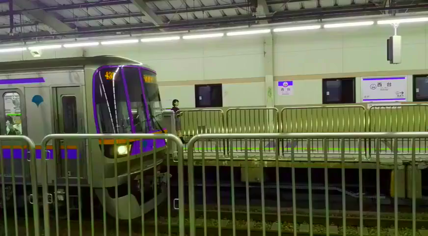

Figure 57.0: applying a hue and saturation

In the example below, the hue is set to 45 degrees with an increased
saturation, as seen in figure 57.0:

```
$ ffmpeg -i input.mp4 -vf "hue=h=45:s=2" output.mp4
```

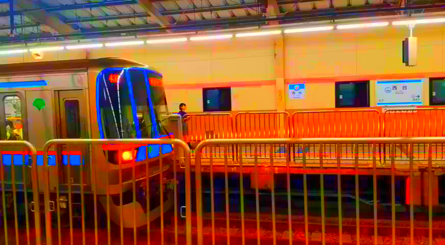

Figure 57.1: dynamic hues

The hue filter also has framing and time parameters that allow for great
effects like animating through hue colors quickly. Expressions can also
be programmed, as seen in figure 57.1:

```
$ ffmpeg -i input.mp4 -vf "hue=H=2*PI*t:s=cos(2*PI*t)+10"
output.mp4
```

```
hue

Indicates the hue filter name

h

Indicates the hue angle as a number of degrees (default 0)

s

Indicates the saturation (10 to -10 with default 1)

H

Indicates hue angle as a number of radians (default 0)

b

Indicates the brightness (10 to -10 with default 0)

n

Indicates frame count of the input frame (starts at 0)

t

Indicates the timestamp (HH:MM:SS)
```

## 58. How to Convert a Video to Black and White?

Turning a video to black and white is also accomplished by using the hue
filter.


Figure 58.0: black and white video

Setting the saturation value to 0 results in a black and white video, as
seen in figure 58.0:

```
$ ffmpeg -i input.mp4 -vf "hue=s=0" output.mp4
```

**Challenge:** In addition to changing the video to black and white, add
a grain filter to make the video look vintage.

## 59. How to Edit the Saturation of a Video?

Although the hue filter has a saturation variable, FFmpeg also has
another filter called vibrance which is used to adjust the color
intensity. Both filters give slightly different saturation effects but
each has its place.


Figure 59.0: max boosted saturation

In this example, all colors are boosted in the video, as seen in figure
59.0:

```
$ ffmpeg -i input.mp4 -filter_complex "vibrance=intensity=2"
-pix_fmt yuv420p output.mp4
```

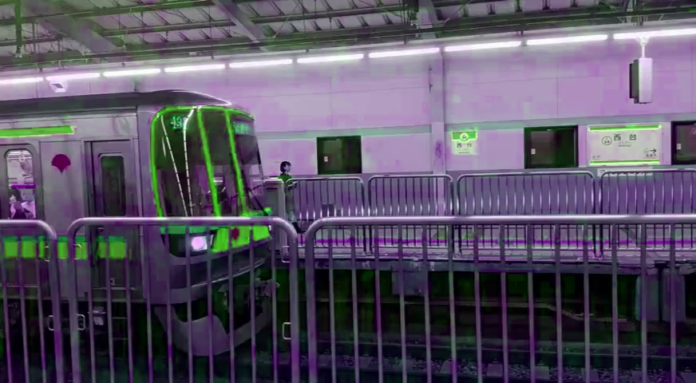

Figure 59.1: negative intensity + green saturation

A specific color can also be set to apply a saturation. In this example,
a negative intensity with a green saturation is applied. As seen in
figure 59.1:

```
$ ffmpeg -i input.mp4 -filter_complex
"vibrance=intensity=-2:gbal=10" -pix_fmt yuv420p output.mp4

```

**Tip:** In figure 59.1, the video quality took a bit hit. Question 16,
*"How to Use -filter_complex Without Losing Video Quality?"*, explains
how to fix this.

```
intensity

Indicates the strength of the saturation boost. Positive value boosts
while negative value alters (2 to -2 with default 0)

rbal

Indicates the red balance (10 to -10 with default 1)

gbal

Indicates the green balance (10 to -10 with default 1)

bbal

Indicates the blue balance (10 to -10 with default 1)

rlum

Indicates the red luma coefficient (1 to 0 default 0)

glum

Indicates the green luma coefficient (1 to 0 default 0)

blum

Indicates the blue luma coefficient (1 to 0 default 0)
```

## 60. How to Invert the Colors of a Video?

FFmpeg has a very simple filter, negate, that inverts the colors of the
input. The train station looks really futuristic with this filter on.


Figure 60.0: inverted video

Although this filter is simplistic in use, it has a great effect, below
is the command as seen in figure 60.0:

```
$ ffmpeg -i input.mp4 -vf "negate" output.mp4
```

## 61. How to RGB Shift a Video?

RBG shifting is one of the coolest and easiest effects for emulating 3D
or add that Vaporwave Aesthetics. With rgbashift, the RGBA pixels can
freely shift horizontally and/or vertically.

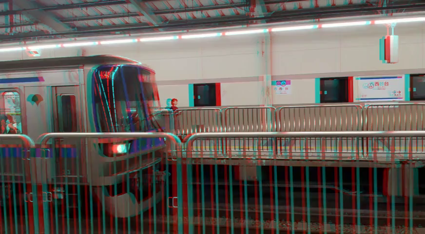

Figure 61.0: red horizontal shift

In this example, a red horizontal shift is applied to create red/blue
3D, as seen in figure 61.0:

```
$ ffmpeg -i input.mp4 -vf "rgbashift=rh=-10" -pix_fmt yuv420p
output.mp4
```


Figure 61.1: blue horizontal shift

In this example, a blue horizontal shift is applied, as seen in figure
61.1:

```
$ ffmpeg -i input.mp4 -vf "rgbashift=bh=10" -pix_fmt yuv420p
output.mp4
```


Figure 61.2: green vertical shift

In this example, a green vertical shift is applied, as seen in figure
61.2:

```
$ ffmpeg -i input.mp4 -vf "rgbashift=gv=10" -pix_fmt yuv420p
output.mp4
```

```
rgbashift

Indicates the rgba shift filter name

rh

Indicates red horizontal (255 to -255 with default 0)

rv

Indicates red vertical (255 to -255 with default 0)

gh

Indicates green horizontal (255 to -255 with default 0)

gv

Indicates green vertical (255 to -255 with default 0)

bh

Indicates blue horizontal (255 to -255 with default 0)

bv

Indicates blue vertical (255 to -255 with default 0)

ah

Indicates alpha horizontal (255 to -255 with default 0)

av

Indicates alpha vertical (255 to -255 with default 0)
```

## 62. How to Apply a Vignette to a Video?

A *vignette* is a fade that is added to the edges of an input. It's a
simple way to add atmosphere or emulate vintage television sets.


Figure 62.0: vignetting

A vignette can be added without additional parameters as seen in figure
62.0:

```
$ ffmpeg -i input.mp4 -vf "vignette" output.mp4
```

The vignette filter also has an angle parameter to adjust the angle of
the fade. Below is a vignette with a 30 degree angle:

```
$ ffmpeg -i input.mp4 -vf "vignette=angle=PI/6" output.mp4
```

```
vignette

Indicates the vignette filter name

angle, a

Indicates the angle in radians (PI/2 to 0 with default PI/5)

x0, y0

Indicates the center coordinates

mode

Indicates the forward or backward mode (forward or backward)
```

For more information about additional vignette parameters visit:
[https://ffmpeg.org/ffmpeg-filters.html#vignette-1](https://ffmpeg.org/ffmpeg-filters.html#vignette-1)

## 63. How to Remove All Colors Except One From a Video?

FFmpeg has a filter called colorhold with documentation that states:

> "Remove all color information for all RGB colors except for \[a\]
> certain one."

This is incorrect, colorhold does not work this way... well not exactly.
It removes colors but it's completely unpredictable.


Figure 63.0: left original / right cyan color hold

For example, in input.mp4 there are two blue bars on the train. If the
exact blue is taken from the video and colorhold is applied, no color is
removed. If a pure cyan color is kept with colorhold, the bottom blue
bar & red is removed yet the top blue bar is kept and the interior wall
colors remain the same.

Figure 63.0 shows this inconsistency:

```
$ ffmpeg -i input.mp4 -vf "colorhold=color=00FFFF:similarity=1"
-pix_fmt yuv420p output.mp4
```

Technically with enough effort and guess work, removing all colors
except one is possible with colorhold.

```
colorhold

Indicates the colorhold filter name

color

Indicates the color which isn't replaced with the color gray

similarity

Indicates the similar color percentage based on color. The larger the
number the larger the similarity (1.0 to 0.1 default 0)

blend

Indicates the blend percent of gray (1.0 to 0.0 default 0.0)
```


## 64. How to Generate a Color Palette From a Video?

Ever look at a video with an amazing color grading and wish you could
copy it? Getting that look can be accomplished using the palettegen
filter. palettegen generates a single palette for an entire video stream
and saves it as an image file.


Figure 64.0: color palette for input.mp4 (enlarged)

In this example, a color palette of 256 pixels is generated, as seen in
figure 64.0:

```
$ ffmpeg -i input.mp4 -vf "palettegen" palette.png
```

The palette.png is rather tiny but is very powerful when combined with
the paletteuse filter. More information on using this color palette,
visit question 65, *"How to Apply a Color Palette to a Video?"*.

## 65. How to Apply a Color Palette to a Video?

In question 64, *"How to Generate a Color Palette From a Video?"*, a 256
pixel palette.png was generated from input.mp4. In this example, the
same palette.png is applied to input2.mp4 giving it the same color
palette input.mp4 had.

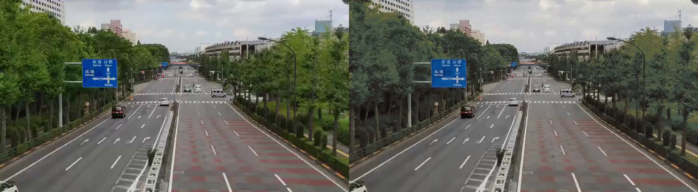

Figure 65.0: the input.mp4 color palette applied to input2.mp4

The difference is subtle yet very aesthetically pleasing. The new
palette applies faded blue color where green was once seen, as seen in
figure 65.0:

```
$ ffmpeg -i input2.mp4 -i palette.png -filter_complex "paletteuse"
-c:v libx264 -pix_fmt yuv420p output.mp4
```

```
paletteuse

Indicates the palette use filter name

dither

Indicates the selected dithering mode (default is sierra2_4a)

bayer

Ordered 8x8 bayer dithering

heckbert

Paul Heckbert's simple error diffusion

floyd_steinberg

Floyd and Steingberg dithering

sierra2

Frankie Sierra dithering v2

sierra2_4a

Frankie Sierra dithering v2 "Lite"
```

For more information on the advanced parameters available for
paletteuse, visit:
[https://ffmpeg.org/ffmpeg-filters.html#paletteuse](https://ffmpeg.org/ffmpeg-filters.html#paletteuse)

# Sharpening / Blurring Filters

This subsection of video filters investigates the various ways to
sharpen and blur video. This includes the filters unsharp, smartblur,
gblur, boxblur and pixeliz0r.

## 66. How to Sharpen a Video with Unsharp?

The unsharp filter is used to sharpen or blur an input. Sharpening
emphasizes shapes, colors and lines to give a clearer image. This filter
has a couple of useful parameters to fine tune the effect but in this
example let's keep it simple.


Figure 66.0: left original / right max sharpen

In video editing two key terms are often passed around, Luma and Chroma.
*luma* is the brightness of the image while *chroma* is the color
information. Maxing out both variables result in a sharper image, as
seen in figure 66.0:

```
$ ffmpeg -i input.mp4 -vf
"unsharp=luma_amount=1.5:chroma_amount=1.5" output.mp4
```

If negative values are set the image instead is slightly blurred. This
filter works for a specific blur aesthetic but FFmpeg has other options
for blurring. See question 67, *"How to Blur a Video with Unsharp?"*,
for more details.

```
unsharp

Indicates the unsharp filter name

luma_amount

Indicates the luma effect strength (1.5 to -1.5 with default 1.0)

chroma_amount

Indicates the chroma effect strength (1.5 to -1.5 with default 0.0)
```

For more information about this filter, visit:
[https://ffmpeg.org/ffmpeg-filters.html#unsharp-1](https://ffmpeg.org/ffmpeg-filters.html#unsharp-1)

## 67. How to Blur a Video with Unsharp?

FFmpeg has another sharpen/blur filter called unsharp. Although it's
still not as strong as some filters, it does have it's own aesthetic.


Figure 67.0: left original / right unsharp blur

In this example, unsharp provides the bluriest image possible with this
filter. as seen in figure 67.0:

```
$ ffmpeg -i input.mp4 -vf
"unsharp=luma_amount=-1.5:chroma_amount=-1.5" output.mp4
```

```
unsharp

Indicates the unsharp filter name

luma_amount

Indicates the luma effect strength (1.5 to -1.5 with default 1.0)

chroma_amount

Indicates the chroma effect strength (1.5 to -1.5 with default 0.0)
```

## 68. How to Blur a Video with Smartblur?

Between blurring with unsharp or smartblur, smartblur gives a stronger
result. The blur with this filter looks less foggy but has more of a
blur glow effect. Smartblur still uses luma and chroma but with more
control.


Figure 68.0: left original / right luma based blur

In this example, the luma radius and strength are used to blur the
video, as seen in figure 68.0:

```
$ ffmpeg -i input.mp4 -filter_complex "smartblur=lr=5:ls=1"
output.mp4
```


Figure 68.1: left original / right "glowing" blur

In this example, all luma and chroma parameters are used to give the
blur a glowing effect. Most notably, the red and blues pop, as seen in
figure 68.1:

```
$ ffmpeg -i input.mp4 -filter_complex
"smartblur=lr=5:ls=1:lt=30:cr=5:cs=-1:ct=30" output.mp4
```

**Tip:** *luma* is the brightness of the image while *chroma* is the
color information.

```
smartblur

Indicates the smartblur filter name

luma_radius, lr

Indicates the luma radius which specifies a gaussian blur (0.1 to 5 with
default 1.0)

luma_strength, ls

Indicates the luma strength. Positive numbers blur the image while
negative sharpens (-1.0 to 1.0 with default 1.0)

luma_threshold, lt

Indicates the threshold of blurring or not. Values between -30 to 0
filter the edges while 0 to 30 filter the flat areas (-30 to 30 with
default 0)

chroma_radius, cr

Indicates the chroma radius which specifies the gaussian blur (0.1 to
5.0 with default luma_strength)

chroma_strength, cs

Indicates the chroma strength. Positive numbers blur the image while
negative sharpens (-1.0 to 1.0 with default 1.0)

chroma_threshold, ct

Indicates the chroma threshold of blurring or not. Values between -30 to
0 filter the edges while 0 to 30 filter the flat areas (-30 to 30 with
default 0)
```

## 69. How to Apply a Gaussian Blur to a Video?

The *Gaussian blur* is probably the most popular blur in video editing.
It gives a very clean smooth blur and it's very easy to use with the
gblur filter.


Figure 69.0: maximum Gaussian blur

In this example, the maximum blur is set. It might look gray in figure
69.0 but the effect is embellished with video playback:

```
$ ffmpeg -i input.mp4 -vf "gblur=sigma=1024" output.mp4
```


Figure 69.1: standard Gaussian blur

In this example, a normal blur is set, as seen in figure 69.1:

```
$ ffmpeg -i input.mp4 -vf "gblur=sigma=10" output.mp4
```

```
gblur

Indicates the gaussian blur filter name

sigma

Indicates the horizontal sigma or peak spread. The higher the value the
blurrier the output (0 to 1024 with default 0.5)
```

## 70. How to Apply a Box Blur to a Video?

A *boxblur* is another blur algorithm that uses a form of low-pass blur
filtering. The blur is dependent on the neighboring pixels applying an
average blur to each.


Figure 70.0: left smartblur / right boxblur

Just like the smartblur filter, boxblur uses *luma* and *chroma*
parameters. In this example, a comparison between smartblur and boxblur
with similar luma_radius is shown in figure 70.0:

```
$ ffmpeg -i input.mp4 -vf "boxblur=lr=2" -pix_fmt yuv420p output.mp4
```

**Tip:** It seems the smartblur has more detail than the boxblur in this
example.

```
The boxblur filter does have additional parameters that smartblur does
not.

boxblur

Indicates the box blur filter name

alpha_radius, ar

Indicates the expressions for box radius or area in pixels for blurring
(default luma_radius)

luma_radius, lr

Indicates the luma radius which specifies a luma blur radius (0.0 to 240
with default 2.0)

luma_power, lp

Indicates the luma power (0 to 2.14748e+09 with default 2.0)

chroma_radius, cr

Indicates the chroma radius which specifies a chroma blur radius (0.0 to
120.0 with default luma_radius)

chroma_power, cs

Indicates the chroma strength (-1 to 2.14748e+09)
```

**Tip:** alpha_radius is rather complicated and does not meet the
specification for this book, for more information visit:
[https://ffmpeg.org/ffmpeg-filters.html#boxblur](https://ffmpeg.org/ffmpeg-filters.html#boxblur)

## 71. How to Apply a Pixelated Effect to a Video?

There are multiple ways to pixelate a video, the most common answer on
the internet is to use the Frei0r filter, pixeliz0r. *Frei0r* is a
collection of 3rd party filters maintained by the Frei0r community,
think of it as an optional plugin FFmpeg has access to.

**Tip:** For more information about Frei0r, refer to question 103, *"How
to Use Frei0r Filters?"*.


Figure 71.0: pixeliz0r filter

The output of the pixeliz0r is shown in figure 71.0:

```
$ ffmpeg -i input.mp4 -vf "frei0r=filter_name=pixeliz0r" -pix_fmt
yuv420p output.mp4
```


Figure 71.1: scaling method

The pixeliz0r method works, but requires Frei0r to be configured with
FFmpeg. An alternative native option is to scale down the input video,
losing pixels and then scaling it back to the original resolution. This
is shown in figure 71.1:

```
$ ffmpeg -i input.mp4 -vf
"scale=iw/8:ih/8,scale=8*iw:8*ih:flags=neighbor" output.mp4
```

**Tip:** the *flag* argument is set to the nearest neighbor here because
without this flag, the output is blurry instead of pixelated.

For more information on scaling refer to question 78, *"How to Change
Video Resolution?"*.

# Video Playback Filters

This section covers typical video editor functionality like slowing down
/ speeding up, reversing, cropping, changing frame-rate and resolution,
and more. This is a great addition to the timeline editing section. You
are on your way to editing video on the fly quicker than ever!

## 72. How to Adjust the Volume of a Video?

For the first filter in this section let cover an easy one, volume.
Previously in question 27, *"How to Adjust Audio Volume?"*, it was
discussed how easy it is to change audio volume. The command for MP4
uses the exact filter.

In this example the volume of an MP4 increases by 20dB:

```
$ ffmpeg -i input.mp4 -af "volume=volume=20dB" output.mp4
```

The volume value can also be a negative value to decrease the volume as
seen in the following example:

```
$ ffmpeg -i input.mp4 -af "volume=volume=-20dB" output.mp4
```

```
volume

Indicates the volume filter name

volume

Indicates the volume value (input_volume * value = output_volume)
```

The volume filter has over 17 different parameters to precisely change
the sound. For more information visit,
[http://ffmpeg.org/ffmpeg-filters.html#volume](http://ffmpeg.org/ffmpeg-filters.html#volume)

## 73. How to Slow Down a Video?

FFmpeg has a simple filter to artificially slow down a video called
setpts. This filter alters the presentation timestamp of the clip which
results in the playback speed being affected.

In this example, the input video increases the duration by 2 but the
speed by half:

```
$ ffmpeg -i input.mp4 -vf "setpts=2.0*PTS" output.mp4
```

The only issue with the above command is the video is changed but the
audio is not. To fix this, the filter asetpts (the audio version of
setpts) is used to change the audio playback speed. Through the use of
chaining, both filters can be applied at the same time:

```
$ ffmpeg -i input.mp4 -filter_complex
"[0:v]setpts=2.0*PTS[v];[0:a]asetpts=2.0*PTS[a]" -map
"[v]" -map "[a]" output.mp4
```

Due to the nature of slowing down a video, the playback may feel rather
choppy. FFmpeg has a solution to this called *minterpolate*. The
minterpolate filter smoothes the video with a motion interpolation
filter. This optional command takes the output.mp4 generated in the
above commands and creates a new output, minterpolate.mp4:

```
$ ffmpeg -i output.mp4 -vf
"minterpolate=mi_mode=mci:mc_mode=aobmc:vsbmc=1:fps=60"
minterpolate.mp4
```

The minterpolate filter has various modes and parameters for
configuration but is outside the scope of the book. The example above
with aobmc provides the highest quality motion interpolation but also
requires the most compute time.

**Tip:** For more information on minterpolate, visit:
[https://ffmpeg.org/ffmpeg-filters.html#minterpolate](https://ffmpeg.org/ffmpeg-filters.html#minterpolate)

```
setpts

Indicates the name of the video filter that changes the presentation
timestamp speed

PTS

Indicates the shorthand for presentation timestamp

asetpts

Indicates the name of the audio filter that changes the presentation
timestamp speed

minterpolate

Indicates the name of the motion interpolation filter

mi_mode

Indicates the motion interpolation mode

mci

Indicates Motion compensation interpolation. Selecting this mode
requires mc_mode to be used with specific motion estimation modes (See
mc_mode below)

dup

Duplicate previous or next frame

blend

Blend source frame from previous to the next frame

mc_mode

Indicates the motion estimation mode and must be set if mi_mode is mci

aobmc

Indicates an adaptive overlapped block motion compensation mode that is
controlled adaptively based on the reliability of the neighboring motion
vectors

obmc

Indicates the block motion compensation

vsbmc

Indicates if variable-size block motion compensation should be enabled.
Enable this for less blur

fps

Indicates the output frame rate (default is 60)
```

## 74. How to Speed Up a Video?

In question 73, *"How to Slow Down a Video?"*, it addressed the various
pitfalls and parameters required to slow down a video. Using the same
filters; setpts and asetpts also increase the video speed.

In this example, the video and audio is sped up 2x the original:

```
$ ffmpeg -i input.mp4 -filter_complex
"[0:v]setpts=0.5*PTS[v];[0:a]asetpts=0.5*PTS[a]" -map
"[v]" -map "[a]" output.mp4
```

**Tip:** the lower the number the faster the playback.

```
setpts

Indicates the name of the video filter that changes the presentation
timestamp speed

PTS

Indicates the shorthand for presentation timestamp

asetpts

Indicates the name of the audio filter that changes the presentation
timestamp speed
```

## 75. How to Reverse a Video?

The reverse filter is another great example of how FFmpeg can solve a
problem quicker than a GUI video editor. The command is simple and the
results are a reversed video with audio reversed as well:

```
$ ffmpeg -i input.mp4 -filter_complex
"[0:v]reverse;[0:a]areverse" output.mp4
```

This filter requires the video to be stored in the memory buffer,
meaning it's quicker to break up the video and reverse multiple segments
and merge it all back together than it is to apply this filter on a
large file.

```
reverse

Indicates the video reverse filter name

areverse

Indicates the audio reverse filter name
```

**Tip:** See question 50, *"How to Splice a Video into Segments?"* and
question 51, *"How to Stitch Segments to One Video?"*, for more
information.

## 76. How to Crop a Video?

In cases where a video requires a new dimensional crop, the use of the
crop filter makes it easy.


Figure 76.0: cropping from a specific position

This is useful for example, to crop a video to fit on Instagram or
remove an area from a video. In this example, the video crops to 300px
by 200px from the position x=10 and y=20, as seen in figure 76.0:

```
$ ffmpeg -i input.mp4 -vf "crop=w=300:h=200:x=10:y=20" output.mp4
```


Figure 76.1: cropping from center

In this example, the video crops to 300px by 200px from the center of
the video, as seen in figure 76.1:

```
$ ffmpeg -i input.mp4 -vf "crop=w=300:h=200" output.mp4
```


Figure 76.2: dynamically cropping from center

In this example, the video is dynamically cropped 1/4th the original
input size from the center, as seen in figure 76.2:

```
$ ffmpeg -i input.mp4 -vf "crop=w=1/4*in_w:h=1/4*in_h" output.mp4
```

```
crop

Indicates the cropping filter name

w, out_w

Indicates the width of the output video (default input width, iw)

h, out_h

Indicates the height of the output video (default input height, ih)

x

Indicates the horizontal position (defaults to (in_w-out_w)/2)

y

Indicates the vertical position (defaults to (in_h-out_h)/2)

keep_aspect

Indicates if the crop forces an output display with an aspect ratio
(default 0, enable 1)

in_w

Indicates the input width

in_h

Indicates the input height
```

**Tip:** The crop filter has more parameters to control the crop not
covered in this section. For more information, visit:
[https://ffmpeg.org/ffmpeg-filters.html#crop](https://ffmpeg.org/ffmpeg-filters.html#crop)

## 77. How to Change the Frame Rate of a Video?

Changing the frame rate of a video is a useful task to lower the disk
space a video takes up. For example, a 60 FPS video converted to 30 FPS
has 50% fewer frames, thus creating a smaller video. There are two
variations to be covered depending on personal requirements.

If the frame rate needs to be set before a filter is applied used -r. In
this example, the frame rate is changed to 24 FPS:

```
$ ffmpeg -r 24 -i input.mp4 output.mp4
```

If the frame rate needs to be set during a filter chain, the fps filter
is used. In this example, the frame rates is changed to 30 FPS:

```
$ ffmpeg -i input.mp4 -vf "fps=fps=30" output.mp4
```

**Tip:** some discussion on "-r vs fps" shows -r sometimes generates too
many output frames. More information, visit:
[https://superuser.com/questions/584760/whats-the-meaning-of-ffmpegs-fps-options](https://superuser.com/questions/584760/whats-the-meaning-of-ffmpegs-fps-options)

## 78. How to Change the Resolution of a Video?

The easiest way to resize a video is to use the scale filter. There are
various standard resolutions in the world of video, so let's take a look
at converting to the most common.

Standard Definition 480p (640x480):

```
$ ffmpeg -i input.mp4 -vf "scale=640:480,setsar=1" output.mp4
```

High Definition 720p (1280x720):

```
$ ffmpeg -i input.mp4 -vf "scale=1280:720,setsar=1" output.mp4
```

Full HD 1080p (1920x1080):

```
$ ffmpeg -i input.mp4 -vf "scale=1920:1080,setsar=1" output.mp4
```

4K (3840x2160):

```
$ ffmpeg -i input.mp4 -vf "scale=3840:2160,setsar=1" output.mp4
```


Figure 78.0: fixed aspect ratio

If the input video does not conform to the specific resolution ratio,
the output video is stretched. Typically, this is fixed by adding black
borders to keep the aspect ratio. Here's an example of using the pad
filter to add the black borders, as seen in figure 78.0:

```
$ ffmpeg -i input.mp4 -vf
"scale=640:480:force_original_aspect_ratio=decrease,pad=640:480:(ow-iw)/2:(oh-ih)/2"
output.mp4
```

```
scale

Indicates the scale filter name

width, w

Indicates the width of the output video (default is input width)

height, h

Indicates the height of the output video (default is input width)

force_original_aspect_ratio

Indicates enabling the increasing or decreasing of output video width or
height to fit the aspect ratio

disable

Disable this feature

decrease

Decrease the dimension if needed

increase

Increase the dimensions if needed

pad

Indicates the name of the pad filter

width, w

Indicates the width of the output padding (default is 0)

height, h

Indicates the height of the output padding (default is 0)
```

## 79. How to Apply Quantization to a Video?

Applying a *quantization* to a video is a way to reduce file size while
keeping near the same video quality. This can be useful for uploading a
file to Discord or other websites that have file size limitations.

Wikipedia explains quantization as:

> "Quantization, involved in image processing, is a lossy compression
> technique achieved by compressing a range of values to a single
> quantum value. When the number of discrete symbols in a given stream
> is reduced, the stream becomes more compressible."

Luckily, the use of quantization is accomplished with a simple video
filter, qp:

```
$ ffmpeg -i input.mp4 -vf "qp" output.mp4
```

## 80. How to Remove Duplicate Frames From a Video?

At some point using -r to change the frame rate or using minterpolate to
smooth a slow motion video, duplicate frames might be generated. This
might not be an issue for playback but when trying to compress a file to
a smaller size, removing frames is a quick task.

FFmpeg has a filter called mpdecimate which removes frames that do not
differ greatly. In some cases this filter can also be used to fix videos
that were *inverse-telecined* incorrectly. The example below is the
simplest form of using mpdecimate:

```
$ ffmpeg -i input.mp4 -vf "mpdecimate" output.mp4
```

That about covers manipulating a video's playback or compressing file
sizes. Just a friendly reminder, some of these filters have an audio
equivalent as not all video filters work on audio.

Cropping a video or setting its resolution is great but what about
applying transformations to a video? Sometimes a video does need to be
rotated or flipped. In the next section, "*Video Transformation
Filters",* you'll build on the information learned previously and expand
them even more.

# Video Transformation Filters

In this section the topics of stacking, flipping and rotating is
discussed. The stacking filters are great for putting multiple videos
side by side. A task which is so much quicker in FFmpeg than in a GUI.

The flipping and rotation filters are quick and easy as well. Again, way
quicker than using a GUI. Starting to see the pattern?

## 81. How to Stack Multiple Videos Horizontally?

Throughout this entire book, the hstack filter has been used to create
comparison "figure images". It's a filter that once you start using it,
you'll wish you knew it sooner.


Figure 81.0: left input1.mp4 / right input2.mp4 in one output

The hstack filter takes two or more inputs, stacks them horizontally and
outputs a new larger resolution video, as seen in figure 81.0:

```
$ ffmpeg -i input1.mp4 -i input2.mp4 -filter_complex "hstack"
output.mp4
```

If more than 2 inputs are required, the inputs variable must be set:

```
$ ffmpeg -i input1.mp4 -i input2.mp4 -i input3.mp4 -filter_complex
"hstack=inputs=3" output.mp4
```

**Tip:** The height of each video must be the same.

**Tip:** The shortest duration input stops on the last frame while the
remaining inputs continue to play. To prevent this, you'll need to
additionally add trimming.

## 82. How to Stack Multiple Videos Vertically?

The vstack filter is the same as the hstack except the videos are
stacked vertically. This filter does take up more space visually but
works great for cases like *Instagram TV* that require two displays.

**Challenge:** Add white space padding, add some subtitles to the video
and you now have all the tools needed to become a social media
influencer.

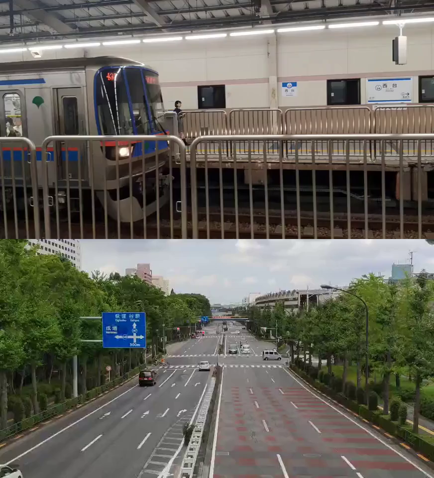

Figure 82.0: top input1.mp4 / bottom input2.mp4 in one output

The vstack filter takes two or more inputs, stacks them vertically and
outputs a new larger resolution video, as seen in figure 82.0:

```
$ ffmpeg -i input1.mp4 -i input2.mp4 -filter_complex "vstack"
output.mp4
```

If more than 2 inputs are required, the inputs variable must be set:

```
$ ffmpeg -i input1.mp4 -i input2.mp4 -i input3.mp4 -filter_complex
"vstack=inputs=3" output.mp4
```

**Tip:** The width of each video must be the same.

## 83. How to Horizontal Flip a Video?

A horizontal flip applied to an input is easy to do with the hflip
filter.


Figure 83.0: mirroring on the horizontal axis

This effect is also known as mirroring on the horizontal axis, as seen
in figure 83.0:

```
$ ffmpeg -i input.mp4 -vf "hflip" output.mp4
```

**Tip:** Applying a horizontal flip mirrors text.

## 84. How to Vertically Flip a Video ?

A vertical flip applied to an input is easy to do with the vflip filter.


Figure 84.0: mirroring on the vertical axis

This effect is also known as mirroring on the vertical axis, as seen in
figure 84.0:

```
$ ffmpeg -i input.mp4 -vf "vflip" output.mp4
```

## 85. How to Rotate a Video?

There are multiple ways to rotate a video in FFmpeg. The first filter,
rotate, rotates the input video by an arbitrary angle in radians. While
the second filter, transpose, can be used with predefined rotation
variables.


Figure 85.0: 45 degree rotation

In this example, the video rotates 45 degree and a black background is
automatically applied, as seen in figure 85.0:

```
$ ffmpeg -i input.mp4 -vf "rotate=45*PI/180" output.mp4
```

**Tip:** Rotation with rotate has various parameters such as fillcolor,
interpolation, and different ways to apply expressions for time, width,
height, etc. For more information visit:
[https://ffmpeg.org/ffmpeg-filters.html#rotate](https://ffmpeg.org/ffmpeg-filters.html#rotate)

Another way to rotate video is with the transpose filter. This filter
has presets for clockwise and counterclockwise rotation.

90 degree Counterclockwise with vertical flip:

```
$ ffmpeg -i input.mp4 -vf "transpose=0" output.mp4
```

90 degree clockwise:

```
$ ffmpeg -i input.mp4 -vf "transpose=1" output.mp4
```

90 degree counterclockwise:

```
$ ffmpeg -i input.mp4 -vf "transpose=2" output.mp4
```

90 degree clockwise with vertical flip:

```
$ ffmpeg -i input.mp4 -vf "transpose=3" output.mp4
```

There's something really powerful about rotating a video from memory or
stacking two inputs to show comparison without ever needing to use a
visual interface. Now what about adding text to a video? Yep! FFmpeg can
do that too. In the next section you'll learn all about it.

# Adding Text to Video

Up to now, FFmpeg has made editing video from a terminal convenient and
oftentimes just plain easier than using a GUI. Adding text to a video is
a bit more complicated due to the fact that video coordinates are
required to be set. Fortunately, FFmpeg does support embedding and
burning subtitles into a video. In this section, all three variations
are covered.

## 86. How to Extract Subtitles From Video?

Extracting subtitles are pretty useful if you want to edit them or just
save a backup copy. It's good to double check subtitles are available to
extract from the video, as sometimes subtitles are hard printed on a
video.

In this example we'll be using an MKV file with subtitles embedded
already. First, to check if a video has subtitles look at its metadata:

```
$ ffmpeg -i input.mkv
<removed **for** clarity>
Stream #0:4(eng): Subtitle: ssa
Metadata:
title : English (Full)
BPS : 97
BPS-eng : 97
DURATION : 00:27:19.200000000
DURATION-eng : 00:27:19.200000000
NUMBER_OF_FRAMES: 353
NUMBER_OF_FRAMES-eng: 353
NUMBER_OF_BYTES : 20040
NUMBER_OF_BYTES-eng: 20040
_STATISTICS_WRITING_APP: mkvmerge v9.2.0 ('Photograph') 64bit
_STATISTICS_WRITING_APP-eng: mkvmerge v9.2.0 ('Photograph') 64bit
_STATISTICS_WRITING_DATE_UTC: 2018-12-02 03:14:25
_STATISTICS_WRITING_DATE_UTC-eng: 2018-12-02 03:14:25
_STATISTICS_TAGS: BPS DURATION NUMBER_OF_FRAMES NUMBER_OF_BYTES
_STATISTICS_TAGS-eng: BPS DURATION NUMBER_OF_FRAMES NUMBER_OF_BYTES
Stream #0:5: Attachment: ttf
Metadata:
filename : seguisb.ttf
mimetype : application/x-truetype-font
```

In the above output regarding input.mkv, in red it is shown that this
file has a subtitle of SSA with English text. In most cases, embedded
subtitles are either SRT or SSA/ASS. Each has its own internal syntax
which is not covered in this book.

To extract the above subtitle type from the MKV, the following command
is used:

```
$ ffmpeg -txt_format text -i input.mkv out.ssa
```

**Tip:** This does require FFmpeg to have libzvbi to be enabled
(\--enable-libzvbi). For more information on subtitle extraction, visit:
[https://trac.ffmpeg.org/wiki/ExtractSubtitles](https://trac.ffmpeg.org/wiki/ExtractSubtitles)

Interestingly enough, FFmpeg also handles the extraction of subtitles
natively. Even though the input.mkv has a ssa subtitle format, FFmpeg
even converts to other subtitle formats without any extra handling. For
example:

```
$ ffmpeg -i input.mkv out.srt
```

The formatting also is standard to srt, as seen in out.srt:

```
1
00:00:01,080 --> 00:00:07,460
<font face="Segoe UI Semibold"
size="60"><b><i>{an3}Hello</i></b></font>

2
00:00:07,540 --> 00:00:15,050
<font face="Segoe UI Semibold"
size="60"><b><i>{an3}World</i></b></font>
```

## 87. How to Add Subtitles to a Video?

In question 86, *"How to Extract Subtitles From Video?"*, it was shown
how to extract subtitles from a video. FFmpeg also supports embedding
common subtitle formats into a video.

Here input.srt is used as an example:

```
1
00:00:01,000 --> 00:00:07,000
Subtitles Added!
```


Figure 87.0: subtitles embedded

In this example, the command requires a subtitle codec, -scodec, which
is used to add subtitles to the output file with the value mov_text.
Here the command embeds input.srt into an output.mp4, as seen in figure
87.0:

```
$ ffmpeg -i input.mp4 -i input.srt -c copy -scodec mov_text output.mp4
```

**Tip:** Some video players do not natively show subtitles. VLC for
example might need subtitles enabled before displaying. See question 88,
*"How to Burn Subtitles into a Video?"*, to hard copy subtitles into a
video.

## 88. How to Burn Subtitles Into a Video?

In question 87, *"How to Add Subtitles to a Video?"*, the final result
embeds the subtitle file into the video but does not burn the subtitles
into the video itself. The benefits of burning subtitles into a video
are that in order to view subtitles, a player with subtitle playback is
not required.

For example, if you wanted to upload a video to Instagram or Twitter
with subtitles, this method is advised. Again, using this example
input.srt, let's burn these words into input.mp4:

```
1
00:00:01,000 --> 00:00:07,000
Subtitles Added!
```


Figure 88.0: burned subtitles

To use the subtitles filter a subtitle file (input.srt) is passed as a
parameter and one input file must be set. The filter automatically
places the subtitle at the bottom of the video, as seen in figure 88.0:

```
$ ffmpeg -i input.mp4 -vf "subtitles=input.srt" output.mp4
```

## 89. How to Overlay Custom Text in a Video?

Subtitles might be too complicated for a video due to creating a
subtitle file. FFmpeg has the drawtext filter that allows for quick text
overlay with parameters such as timing, color and location. drawtext is
a massive filter with over 50 different parameters, so let's keep things
easy.


Figure 89.0: printing hello world

In this example, the text "Hello World" is printed in red color with
64px font at the bottom center part of the screen, as seen in figure
89.0:

```
$ ffmpeg -i input.mp4 -vf "drawtext=text='Hello
World':fontsize=64:fontcolor=red:x=((w-text_w)/2):y=h-70" output.mp4
```

**Tip:** FFmpeg has a standardized coordinate system that all filters
adhere to. All coordinates start at (0, 0) which is the top left.
Starting from (0, 0) the pixels go left to right then top to bottoms.

```
drawetext

Indicates the text drawing filter name

text

Indicates the text that is drawn on the screen

fontsize

Indicates the size of the font

fontcolor

Indicates the color of the text, HEX values (FFFFFF)

x

Indicates the x location

y

Indicates the y location
```

For more information about drawtext, visit:
[https://ffmpeg.org/ffmpeg-filters.html#drawtext-1](https://ffmpeg.org/ffmpeg-filters.html#drawtext-1)

It's actually really great that FFmpeg supports the extraction and
embedding of subtitles. Subtitles have become extremely helpful in
capturing more eyes on social media as less and less people use their
phone's speakers for entertainment. Every single GaryVee video has
subtitles. Most influencers are adding them to their videos. Even the
most popular YouTubers are adding them to draw more attention. Now you
can too!

# Image video filters

This section is a little different than the audio and video section as
this focuses on using images to create videos or to extract them from a
video. Here adding transparent watermarks, creating slideshows,
extracting frames, creating videos and more are answered. FFmpeg really
does cover most multimedia formats.

**Tip:** PNG files are the main input or output in these examples but
all filters should work with JPEG, Bitmap, etc.

## 90. How to Add a Transparent Watermark to a Video?

Adding a transparent watermark to an image is one of the most searched
FFmpeg questions of all time. People are protective of their work and in
the world of memes, it's so easy for someone to claim "I made that".
Luckily, with the overlay filter, it's really easy to put a watermark
anywhere on a video.


Figure 90.0: *3 Slashed Book*s Logo in the bottom right

For this example, logo.png (100px by 34px) is added to the bottom right
of the video, as shown in figure 90.0:

```
$ ffmpeg -i input.mp4 -i logo.png -filter_complex
"overlay=x=main_w-overlay_w-5:y=main_h-overlay_h" -codec:a copy
output.mp4
```

```
overlay

Indicates the overlay filter name. This filter can also be used to
overlay two videos with blending

x, y

Indicates the X and Y coordinates of the overlay. If the value is larger
than the boundaries of the input video, the overlay is not shown

main_w, w

Indicates the main input width

main_h, h

Indicates the main input height

overlay_w, w

Indicates the overlay input width

overlay_h, h

Indicates the overlay input height
```

## 91. How to Create a Slideshow Video From Multiple Images?

This is a neat and quick way to start using FFmpeg for more basic tasks
you might normally accomplish in a larger video editor. Making a
slideshow requires little effort but the use of a sequential pattern in
PNG files must be addressed.

The format in this example looks like this: input-001.png,
input-002.png, input-003.png, input-004.png, etc

Using the below command, each input image stays on screen for 10 second:

```
$ ffmpeg -framerate 1/10 -i input-%03d.png -c:v libx264 -pix_fmt
yuv420p output.mp4
```

In the above example, the %03d variable is the way FFmpeg finds all
inputs with the 3 digit sequence.

**Tip:** The duration of each image in minutes is the inverse of the
framerate. Because the framerate is set before the input.

## 92. How to Extract an Image Frame From a Video at a Specific Time?

Previously -ss or the seeking option was used to trim, here seeking is
used to jump to a specific time. Once the frame is selected, using
FFmpeg to export a PNG file is easy.


Figure 92.0: frame at 10 seconds

In this example, the script seeks to the 10 second mark and output the
frame, as seen in figure 92.0:

```
$ ffmpeg -ss 00:00:10 -i input.mp4 -frames:v 1 output.png
```

If the desired result was to output the next 5 frames from the 10 second
mark, the script below would work:

```
$ ffmpeg -ss 00:00:10 -i input.mp4 -frames:v 5 output-%03d.png
```

```
-frames:v

Indicates the number of frames to be saved as output
```

## 93. How to Add an MP3 to an Image to Create a Video?

This exact question is how I started my FFmpeg journey. I wanted a
quicker way to add an MP3 file to an image so I could share new album
releases in the Vaporwave scene.

At the time I was going into After Effects, importing an image,
importing the audio, dragging the audio and image into the scene.
Cropping the length of the video and then exporting a new video. Then I
was uploading it to Instagram and Twitter. This soon to be 10 second
task was taking me 5-7 minutes in After Effects + another 2-3 uploading
to social media. With all those steps you can understand why. So I am
proud to share here, the first FFmpeg script I ever wrote.

In the example below, an image is looped to create a video with an MP3
attached:

```
$ ffmpeg -loop 1 -i input.png -i input.mp3 -c:v libx264 -pix_fmt
yuv420p output.mp4
```

```
-loop

Indicates the loop argument with a value, the number of loops. In this
case, one image one long loop for the entire duration
```

## 94. How to Convert a Video into a Tile Image?

Ever make a video and want to show off a preview with a couple of
images? This feature is seen in the torrent world for showing video
quality. FFmpeg has a filter called tile which easily allows for a
multi-image grid preview. The tile filter even has additional parameters
like padding, margin and color to use but let's keep in simple.


Figure 94.0: 3x1 tile of input.mp4

In the example below, the script creates a 3x1 or 3 image tile preview,
as seen in figure 94.0:

```
$ ffmpeg -skip_frame nokey -i input.mp4 -vf
"scale=(in_w/3):(in_h/3),tile=layout=3x1" output.png
```

```
tile

Indicates the tile filter name

layout

Indicates the grid size (x by y, ie 3x1)

margin

Indicates the outer border margin in pixels

padding

Indicates the inner border padding between frames in pixels

color

Indicates the margin / padding background color in HEX values (FFFFFF)
```

## 95. How to Generate a Picture Waveform from a Video?

The showwavespic filter generates an audio signal waveform for the
entire audio clip. This might be useful to determine if a volume change
was successful on an output file when comparing it to the input. It also
just looks cool.

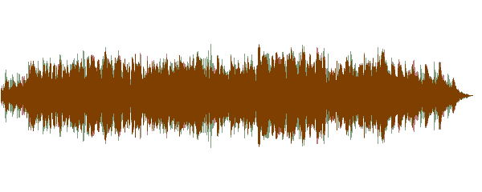

Figure 95.0: the waveform of input.mp3

In this example, the showwavespic filter is at its default settings and
generates an image shown in figure 95.0:

```
$ ffmpeg -i input.mp3 -filter_complex "showwavespic" -frames:v 1
output.png
```

Additional parameters such as setting the color, the waveform colors, a
scale and if the channels are split are also available.

```
showwavespic

Indicates the wave generation filter name

split_channels

Indicates if channels are drawn separately (default 0)

colors

Indicates custom colors of the waveform, each separated by '|'.
Supports common colors (red, blue, green, white, etc) and HEX values
(FFFFFF)

scale

Indicates the amplitude scale

lin

Indicates linear scale

log

Indicates logarithmic scale

sqrt

Indicates square root scale

cbrt

Indicates cubic root scale
```

## 96. How to Generate a Solid Colored Video?

At some point, you might need to generate a solid image video. Actually,
paired with the blending filter (Question 54. *"How to Blend Two Videos
Together?"*), adding stylized colored filters to an entire video is
possible.


Figure 96.0: a solid red standard definition video

In this example, the output video is a red 720 by 480 video that is 30
seconds long, as seen in figure 96.0:

```
$ ffmpeg -f lavfi -i "color=color=red:720x480:d=30" -pix_fmt yuv420p
output.mp4
```

**Tip:** Take note at the fact that there isn't an actual input thus a
virtual input must be created with -f lavfi.

```
-f lavfi

Indicates libavfilter virtual device

color

Indicates the name of the color generation filter. supports common
colors (red, blue, green, white, etc) and HEX values (FFFFFF)

d, duration

Indicates the length of the video clip
```

FFmpeg is mostly known for its use of manipulation with video and audio
but now you know how it can be used with images as well. FFmpeg's use of
images doesn't stop here, you can think of images as a single frame of
video and with that knowledge, any video filter available can also be
applied to images.

FFmpeg can even easily convert one image format to another. FFmpeg
really does cover most multimedia formats.

In the next section, *"Advanced Video Filters"*, you'll learn how to
really take filtering to the next level and create wonderful pieces of
visual art with the output.


# Advanced Video Filters

This section covers multiple advanced video filters to increase FFmpeg
usage. Some examples use 3rd party software or require unstable FFmpeg
builds. This is for the advanced user who wants to extend FFmpeg outside
of the native features.

## 97. How to Datamosh/Glitch a Video?

Datamoshing is an interesting technique of applying movement in one
layer to another. With additional compression and frame removal it
causes a glitchy result that's been all the rage lately in music videos.

Arguably the most high profile use of datamoshing was in A\$AP Mob's
2016 song *"Yamborghini High"*. It's a trippy experience and caught the
imagination of a lot of video editors.

Although the datamoshing effect is possible in pure FFmpeg, the
algorithm to properly create this is rather advanced. Instead, using
*AviGlitch*, a "Ruby library to destroy your AVI files", can be used.

First you'll need to install Ruby / gems if you don't have it already.
Next, we'll install the AviGlitch library:

```
$ sudo gem install aviglitch
```

After installation, convert the input file into an AVI, as AviGlitch
only accepts AVI as input. Now run the newly installed command:

```
$ datamosh input.avi -o output.avi
```

The glitching has finished. So with FFmpeg, convert the new video to a
gif or MP4 to share on social media.

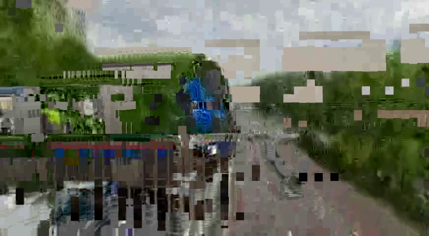

Figure 97.0: Datamoshed

Figure 97.0 shows an example frame of datamoshing but it's difficult to
understand if you've never seen datamoshing before.

In this example, input.mp4 and input2.mp4 are concatenated into one
stream (input3.mp4). The datamosh effect is applied to input3.mp4
resulting in what is seen in Figure 97.0. It looks like the train from
input.mp4 is crashing through the road of input2.mp4. The textures of
the trees in input2.mp4 grab on to the metal color of the train. It's an
effect that needs to be self-tested to grasp the full experience.

The full script is below:

```
$ ffmpeg -i input3.mp4 input.avi
$ datamosh input.avi -o output.avi
$ ffmpeg -i output.avi output.mp4
```

**Tip:** The more movement and scene changes, the better the datamosh.

## 98. How to Add Various Fades to a Video?

Adding a fade adds a dynamic way to concatenate two videos.
Stylistically it looks great and is simple to do with the xfade filter.
This filter has over 30 different transitions to play around with; add
in duration, offset and even custom expressions, xfade almost feels like
a standalone software itself.

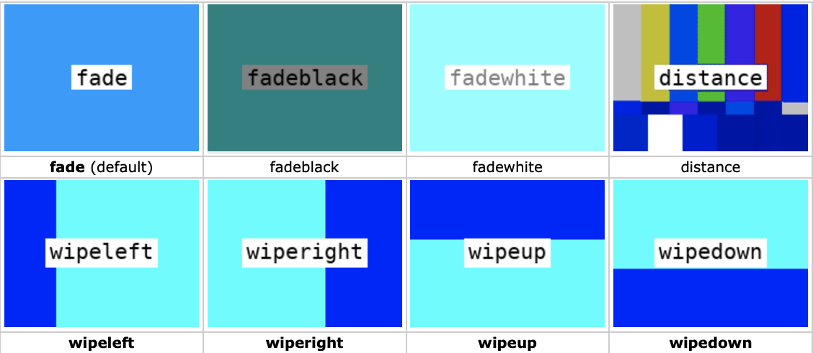

Figure 98.0: various example of fades

**Tip:** xfade is a brand new filter not released on the stable branch
of FFmpeg as of April 2020. A nightly build is required to be installed
to access this functionality.

In this example a wipeup fade is applied to 2 inputs with a duration of
2 seconds 5 seconds before the end of input1.mp4:

```
$ ffmpeg -i input1.mp4 -i input2.mp4 -filter_complex
"xfade=transition=fade:duration=2:offset=5" output.mp4
```

```
xfade

Indicates the fade filter name

transition

Indicates the transition effect to be applied, below are the currently
available transitions:

duration

Indicates the crossfade duration in seconds (default is 1)

offset

Indicates the crossfade start relative to the first input stream in
seconds (default is 0)
```

**Tip:** xfade also has an expression parameter for advanced
configuration, more information at:
[https://ffmpeg.org/ffmpeg-filters.html#xfade](https://ffmpeg.org/ffmpeg-filters.html#xfade)

\*Figure 98.0 is from the wiki, more information:
[https://trac.ffmpeg.org/wiki/Xfade](https://trac.ffmpeg.org/wiki/Xfade)

## 99. How to Add Noise to a Video?

There's something about adding a little noise to a video that makes it
feel older than it is. With the right amount of noise, it can help
layers to look naturally part of the video.


Figure 99.0: temporal noise

In this example, half maximum noise is added and new patterns are
applied between frames (*temporal noise*), as seen in figure 99.0:

```
$ ffmpeg -i input.mp4 -vf "noise=alls=50:allf=t+p+u" -pix_fmt
yuv420p output.mp4
```

```
noise

Indicates the name of the noise filter

all_strength, alls

Indicates the strength of noise, the higher the value the more visible
the noise (0 to 100, default 0)

all_flags, allf

Indicates the pixel component flags, multiple flags can be applied at
once, below are the available flags:

a

Indicates average temporal noise which is smoother

p

Indicates a mix of random noise with semi-regular patterns

t

Indicates a temporal noise (changes between frames)

u

Indicates uniform noise (else it's gaussian)
```

## 100. How to Apply Static to a Video?

In the previous question, *"How to Add Noise to a Video?"*, the noise
was added that had RGB values. This might not be suitable if the
requirement is black and white noise. Black and white noise blends
better and feels more natural.


Figure 100.0: create static from an equation

In this example using the geq filter to generate a new layer \[static\]
full of random black or white pixels is created. Then an overlay blend
is applied to give the final result, as seen in figure 100.0:

```
$ ffmpeg -i input.mp4 -filter_complex
"geq=random(1)*255:128:128[static];
[0:v][static]blend=overlay" output.mp4
```


Figure 100.1: less visible static

In figure 100.0, some might say the black/white is too harsh. Here's an
example using noise and blending to get a more low light grain effect
but results in a sharper darker image, as seen in figure 100.1:

```
$ ffmpeg -i input.mp4 -filter_complex
"[0:v]noise=alls=50:allf=t+p+u,hue=s=0[static];
[0:v][static]blend=overlay[overlay]" -map [overlay] output.mp4
```

```
geq

Indicates the "generic equation" filter

lum_expr, lum

Indicates the luminance expression

cb_expr, cb

Indicates the chrominance blue expression

cb_expr, cr

Indicates the chrominance red expression

alpha_expr, a

Indicates the alpha expression

red_expr, r

Indicates the red expression

green_expr, g

Indicates the red expression

blue_expr, b

Indicates the red expression
```

**Tip:** geq also has various variables and functions that can be
applied to the filter. For more information visit:
[https://ffmpeg.org/ffmpeg-filters.html#geq](https://ffmpeg.org/ffmpeg-filters.html#geq)

## 101. How to Randomize Frames in a Video?

Although at first glance the idea of randomizing the playback frame
order might not seem useful, it's one that can give the most interesting
results. FFmpeg has a simple filter called random that effortlessly
shuffles frames.

By default the randomization is applied to the first 30 frames in the
buffer. This allows for a skittish glitchy effect while keeping the
integrity of the playback because only 30 frames at a time are
randomized:

```
$ ffmpeg -i input.mp4 -vf "random" output.mp4
```

If additional frames are required to shuffle, setting the number of
frames and the number of seeds can be set:

```
$ ffmpeg -i input.mp4 -vf "random=frames=100:seed=50" output.mp4
```

Apply a color shift and the datamosh effect for some really cool
results.

## 102. How to Use Green Screen to Mask a Video Into Another Video?

The use of a *green screen* is the most common way to add a subject to a
scene in video production. By setting the scene at the purest green (not
commonly found in nature) objects can interact on the green screen while
computer generation can replace a new image in the background.

With FFmpeg, this can easily be accomplished using the colorkey filter.
The colorkey filter takes an input, looks for a specific color depending
on similarity, and stores the information in a new stream.


Figure 102.0: greenscreen.mp4

In this example, the use of greenscreen.mp4 is used as a mask to be
applied to input.mp4, as seen in figure 102.0.


Figure 102.1: video applied to a green screen

The result includes the black background but the train video in replace
off the green words, as seen in figure 102.1:

```
$ ffmpeg -i input.mp4 -i greenscreen.mp4 -filter_complex
'[1:v]colorkey=color=00FF00:similarity=0.85:blend=0.0[ckout];[0:v][ckout]overlay[out]'
-map '[out]' output.mp4
```

If you don't have a video version of your image, use parts of the code
in question 93, *"How to Add an MP3 to an Image to Create a Video?"*, to
create a looping single image.

**Tip:** #00FF00 is the pure green found in green screens.

### A Note about frei0r filters

Previously this book covered FFmpeg and it's native filters. Some
filters required special configurations to be enabled like the frei0r
filter. The frei0r filter is almost a filter inside a filter, meaning
frei0r itself is a collection of free video effects. In the next
question, *"How to Use the Frei0r Filters?",* a few common frei0r
filters are outlined to get you started with mastering any filter frei0r
has.

## 103. How to Use the Frei0r Filters?

Using the frei0r filter is an exciting way to beef up your video
production. Since frei0r is a collection of filters in itself, a few
common filters are discussed to get you started. There's a certain wow
factor in using frei0r, from glitching to color effects to emulating
full blown Snapchat / Instagram filters if done right.


Figure 103.0: glowing a glamorous train station

Speaking of Instagram, lately adding a glamorous shining filter has
become all the rage. In this example, we'll simulate the glow of a Tokyo
train station, as seen in figure 103.0:

```
$ ffmpeg -i input.mp4 -vf "frei0r=glow:0.5" -pix_fmt yuv420p
output.mp4
```

You'll notice that the syntax for parameters and the corresponding
variables differ from normal FFmpeg. It isn't glow=0.5 but glow:0.5, so
how does it work with a frei0r filter with multiple parameters? Let's
look at how it's done in this distortion filter, distort0r, below.

Here the distortion filter has 2 parameters that are set after the
frei0r filter name filter_params. Unfortunately, the frei0r filter does
require digging deep into the documentation to understand which
parameters it supports.


Figure 103.1: distort0r applied to input.mp4

The parameters are set in the same order as seen in the documentation.
This makes the code less readable without parameters but shorter due to
the shorthand syntax. According to the documentation for distort0r, the
first value is the *amplitude* and the second is the *frequency* of the
effect. The output of this command can be seen in figure 103.1:

```
$ ffmpeg -i input.mp4 -vf "frei0r=distort0r:filter_params=0.2|0.05"
-pix_fmt yuv420p output.mp4
```

At this point, you should have a better understanding of the proper
syntax for using frei0r. It's a great collection of filters so let's
just look at one more that stands out, the vertigo filter.

If you ever get the chance to visit the Grand Canyon, do it! It's
nothing like what you'd expect and the view below is breathtaking. For
those who don't do well with heights and get vertigo, maybe you can use
this filter to start training your brain for the trip.


Figure 103.2: oh no! vertigo

Here the vertigo filter applies an almost wave-like ghosting effect to
each frame simulating the effects of vertigo, as seen in figure 103.2:

```
$ ffmpeg -i input.mp4 -vf "frei0r=vertigo:0.1" -pix_fmt yuv420p
output.mp4
```

A still image doesn't do it justice as the wave-like moment is what
really gives off the feeling of the room spinning.

For a full list of frei0r filters, visit:
[https://gstreamer.freedesktop.org/documentation/frei0r/index.html?gi-language=c](https://gstreamer.freedesktop.org/documentation/frei0r/index.html?gi-language=c)

**Challenge:** The glamor filter on Instagram probably uses something
like colorkey to select the whiter colors (hence why eyeballs and teeth
are glowy instead of the enter image) and then a frei0r filter like glow
is applied and a star image is centered at the peak of that specific
output. Try out yourself to see if you can emulate the Instagram filter.

**Tip:** For more information on the distort0r filter:
[https://gstreamer.freedesktop.org/documentation/frei0r/frei0r-filter-distort0r.html?gi-language=c#frei0r-filter-distort0r](https://gstreamer.freedesktop.org/documentation/frei0r/frei0r-filter-distort0r.html?gi-language=c#frei0r-filter-distort0r)

The frei0r filter is the most exciting filter to mess around with in
FFmpeg. There are so many video filters that if you're looking to make a
crazy 80s music video, it can be accomplished in a matter of seconds
instead of spending hours in After Effects. Sometimes letting a script
generate unexpected results creates the best results.

What can be more advanced than using the complex filters FFmpeg
provides? Using them in a live setting on streaming platforms. The next
section covers setting up FFmpeg to stream with YouTube.


### YouTube Streaming

Before this book, the experience I had with streaming with FFmpeg was
zero but I reached out to the FFmpeg community and everyone was saying I
needed to cover this topic. Fortunately for me, streaming is actually
way easier than I was expecting.

This section covers streaming to YouTube with FFmpeg but these settings
should work with most streaming services.


## 104. How to obtain a YouTube Streaming key?

To connect to YouTube and send streaming data to their servers, you'll
need to obtain a YouTube streaming URL and YouTube Stream Key.

First, go to
[https://www.youtube.com](https://www.youtube.com) and
click the create a video button and select the 'Go Live' option from the
drop-down, as seen in figure 104.0:

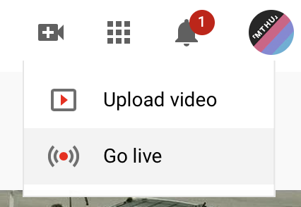

Figure 104.0: Go Live!

Select 'New Stream' and fill out the desired title, description, etc.
Next, select 'Create Stream'. As seen in figure 104.1:

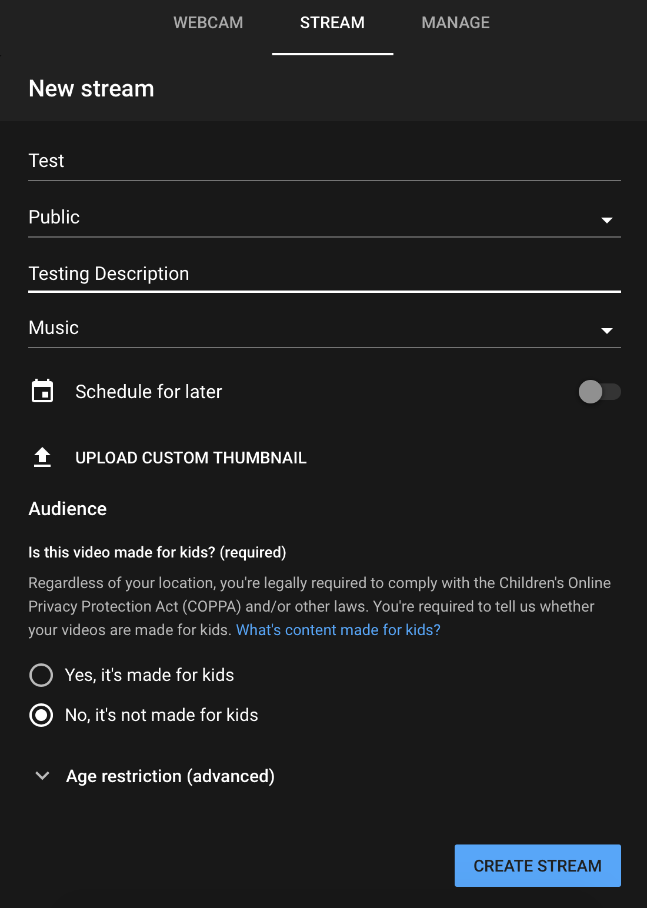

Figure 104.1: Setting up a new stream

**Tip:** Make sure the 'webcam' option isn't selected but 'stream' is.

**Tip:** Actually\... if you'd rather stream the webcam directly from
YouTube, it's probably easier than using FFmpeg.

YouTube now waits for the stream data to hit the YouTube server. Before
data can be sent the URL and Key must be set to send data over *RTMP*.
In short, the Real-Time Messaging Protocol is a stream protocol and the
only one YouTube supports.

The current screen has these two variables available at the bottom left
corner, as seen in figure 104.2:

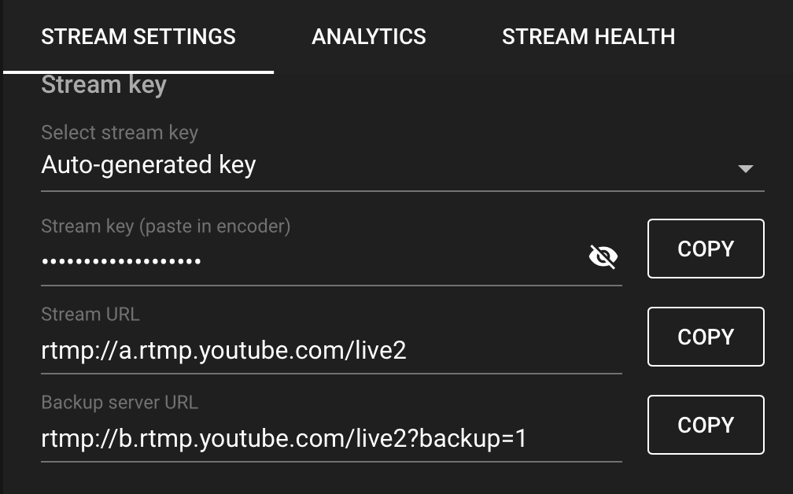

Figure 104.2: stream key and stream URL

Keep these two variables around as they'll be used in the following
questions for streaming to YouTube.

To ensure the stream is working, keep this window open to see a preview
but to go live, the 'Go Live' button must be clicked. Once live, the
live chat is available and you're ready to communicate with your fan
base.

## 105. How to Stream a File to YouTube?

Streaming a local file to YouTube is extremely easy and actually a
feature that really takes your FFmpeg skills to the next level with
little effort.

With the minimal amount of code, this script streams input.mp4 to
YouTube without any issues (stream.sh):

```
YOUTUBE_URL="rtmp://a.rtmp.YouTube.com/live2" # YouTube Streaming
URL
KEY="xxxx-xxxx-xxxx-xxxx" # Your YouTube Streaming Key

ffmpeg -re -i input.mp4 -framerate 30 -f FLV "$YOUTUBE_URL/$KEY"
```

Here a new option is introduced, -re. In streaming, it is imperative for
a stream to run in realtime. The -re option indicates the stream reads
the input at the native frame rate and sends output at the same rate.
Without this flag, the stream receives data faster than the user can
view it. Breaking the realtime point of going live.

**Tip:** -framerate 30 is required else the stream does not start.

## 106. How to Stream a Webcam to YouTube?

Streaming a file to YouTube, it's easy, streaming a webcam video, not so
much. All the tutorials online, including the FFmpeg's Wiki, detail
streaming via webcam without working results at least not to YouTube.
After hours and hours of needing to figure out a solution, here's what
*could* work. These are hacks but here's how to send a webcam stream to
YouTube. Please don't hold me liable for faulty streams.

First identifying the webcam device is required in which each OS has its
own command. This answer focuses on macOS to stream a webcam to YouTube
but parts of Linux are also discussed.

Finding a macOS FaceTime HD Camera at index 0:

```
$ ffmpeg -f avfoundation -list_devices true -i ""
...
[AVFoundation input device @ 0x7f82d94XXXX] AVFoundation video
devices:
[AVFoundation input device @ 0x7f82d94XXXX] [0] FaceTime HD Camera
(Built-in)
[AVFoundation input device @ 0x7f82d94XXXX] [1] Capture screen 0
[AVFoundation input device @ 0x7f82d94XXXX] AVFoundation audio
devices:
[AVFoundation input device @ 0x7f82d94XXXX] [0] Built-in Microphone
```

Finding Linux USB Camera at index 0:

```
+-----------------------------------------------------------------------+
| $ v4l2-ctl --list-devices                                           |
|                                                                       |
| USB3.0 PC CAMERA (usb-0000:00:xx.x-1):                               |
| /dev/video1                                                          |
|                                                                      |
| USB2.0 CAMERA (usb-0000:00:xx.x-2):                                  |
| /dev/video0                                                           |
+=======================================================================+
+-----------------------------------------------------------------------+
```

**Tip:** The index of your webcam may be different.

According to the FFmpeg documentation, this is what the working script
should look like for macOS:

```
$ ffmpeg -f avfoundation -framerate 30 -i "0" -f FLV
"<YOUTUBE_URL>/<YOUTUBE_KEY>"
```

It doesn't. but as mentioned earlier, getting a webcam to stream to
YouTube requires experimentation that through my own guesswork, actually
streams. So two hacks:

1.  An additional input file with a duration longer than the expected > stream length.

2.  A random video filter.

For this example the use of -stream_loop creates an infinite duration.
It seems because avfoundation's webcam outputs MPEG transport stream
(MPEGTS) and YouTube doesn't support UDP streaming. Using this secondary
input might be overriding the webcam stream and FFmpeg uses the
input.mp4 as an FLV stream instead. This could make sense except a
random video filter must be applied else the stream only shows
input.mp4.

Below is a working "hack" version of the script (stream.sh):

```
YOUTUBE_URL="rtmp://a.rtmp.YouTube.com/live2" # YouTube Streaming
URL
KEY="xxxx-xxxx-xxxx-xxxx" # Your YouTube Streaming Key

ffmpeg -f avfoundation -framerate 30 -i "0" -stream_loop -1 -i
input.mp4 
-filter_complex "hue=H=0" 
-f FLV "$YOUTUBE_URL/$KEY"
```

**Tip:** -framerate 30 is required else the stream won't start.

**Tip:** macOS might ask for permission for the terminal to have access
to the webcam. You'll have to accept this permission else the script
does not have access to your webcam. It is recommended to disable access
between streaming sessions.

By default, the microphone audio is not part of the output stream. That
requires an additional index to be set in the first input. If an audio
input isn't set then the input.mp4 audio plays in the background. The
new stream script is as follows (stream.sh):

```
+-----------------------------------------------------------------------+
| YOUTUBE_URL="rtmp://a.rtmp.YouTube.com/live2" # YouTube Streaming  |
| URL                                                                  |
| KEY="xxxx-xxxx-xxxx-xxxx" # Your YouTube Streaming Key             |
|                                                                       |
| ffmpeg -f avfoundation -framerate 30 -i "0:1" -stream_loop -1 -i    |
| input.mp4                                                          |
| -filter_complex "hue=H=0" -map 0:v -map -0:a                     |
| -f FLV "$YOUTUBE_URL/$KEY"                                        |
+=======================================================================+
+-----------------------------------------------------------------------+
```

**Tip:** macOS might ask for permission for the terminal to have access
to the microphone. You'll have to accept this permission otherwise the
script does not have access to your microphone. It is recommended to
disable access between streaming sessions.

For streaming a webcam with other operating systems, visit the FFmpeg
webcam wiki:
[https://trac.ffmpeg.org/wiki/Capture/Webcam](https://trac.ffmpeg.org/wiki/Capture/Webcam)

## 107. How to Use Filters with Video Streaming?

Adding a filter to a video stream is as simple as adding a filter to a
normal input but not all filters work in real-time. Unfortunately the
documentation isn't specific on which filters work but most audio
effects and visual filters do.

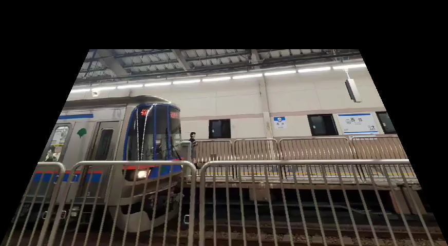

Figure 107.0: streaming the frei0r perspective filter

You'll be happy to know the frei0r filters work with streaming. In this
example the perspective filter skews the input video, as seen in figure
107.0:

```
YOUTUBE_URL="rtmp://a.rtmp.YouTube.com/live2" # YouTube Streaming
URL
KEY="xxxx-xxxx-xxxx-xxxx" # Your YouTube Streaming Key

ffmpeg -re -i input.mp4 -framerate 30 -filter_complex
"frei0r=perspective:0.2/0.2|0.8/0.2" -f FLV "$YOUTUBE_URL/$KEY"
```

Streaming isn't difficult but requires a little extra setup than
previously seen. Once you get over the weird quirks (and hopefully
temporary hacks), it's a powerful feature but might not be the best
practice for traditional streaming. A GUI interface might win this time.

That pretty much covers it for streaming with FFmpeg. If you're a Twitch
or Facebook streamerm try out what you've learned here and apply it on
these platforms. Hopefully it's not as complicated.

At this point, all that is left to cover is the common errors found in
FFmpeg. Soon enough you'll have all the tools to master programming with
FFmpeg.


Common Errors

At one point or another, running into errors might stall development.
This section outlines some of the most common errors found during the
writing of this book.

**Tip:** The FFmpeg wiki also has its own list of Errors:
[https://trac.ffmpeg.org/wiki/Errors](https://trac.ffmpeg.org/wiki/Errors)

## 108. How to Fix the 'width/height not divisible by 2' Error?

The 'width/height not divisible by 2' error is probably the most
common error that is seen once one learns the ins and outs of FFmpeg
syntax. The width/height not divisible by 2 error comes up when the
input video does not have an even height or width. Luckily, it's not a
difficult error to fix, just adjust the width/height to the nearest even
number.

## 109. How to Fix the '\...was expected to have exactly 1 input and 1 output. However, it had \>1 input(s) and 1 output(s)' Error?

This error message is pretty self-explanatory but let's cover when it
might appear. First, the FFmpeg command is expected to have one input
and output but either the input or output has more than one. This might
occur if the command has two inputs but the filter only accepts one
input. This might also occur if more than one output is saved but only
one output file is generated. To fix it, adjust the number of inputs or
outputs to one.

## 110. How to Fix the 'Cannot connect audio filter to non audio input' Error?

When starting to learn FFmpeg, memorizing when to use -vf or -af might
be tricky. If the error, *'Cannot connect audio filter to non audio
input'*, keeps popping up it's because the script specifies the video
filter argument (-vf) but an audio filter is used, for example:

```
$ ffmpeg -i input.mp4 -vf "volume=10dB" output.mp4
```

To fix this error in the example above, use -af or -filter_complex as
seen below:

```
$ ffmpeg -i input.mp4 -af "volume=10dB" output.mp4
```

In some cases like the one above, the input is a video but the filter is
for audio, it is worth noting that -af or *audio filters* can be applied
to videos because videos have audio codecs.

## 111. How to Fix the 'Cannot connect video filter to audio input' Error?

When starting to learn FFmpeg, memorizing when to use -vf or -af might
be tricky. If the error, *'Cannot connect video filter to non video
input'*, keeps popping up it's because the script specifies the audio
filter argument (-af) but a video filter is used, for example:

```
$ ffmpeg -i input.mp4 -af "boxblur=10" output.mp4
```

Obviously, the boxblur filter is a video filter thus -af should not be
used. To fix this error in the example above, use -vf or -filter_complex
as seen below:

```
$ ffmpeg -i input.mp4 -vf "boxblur=10" output.mp4
```

It is worth noting that -vf or *video filters* can never be applied to
an audio source alone.

## 112. How to Fix the 'No such filter: x' Error? {#how-to-fix-the-no-such-filter-x-error .unnumbered}

This is a common error seen when an expected filter is not available.
For example, if a filter isn't enabled, the following shows:

```
+-----------------------------------------------------------------------+
| No such filter: 'X'                                                   |
|                                                                       |
| Error reinitializing filters!                                         |
|                                                                       |
| Failed to inject frame into filter network: Invalid argument          |
+=======================================================================+
+-----------------------------------------------------------------------+
```

The error might also look like this:

```
ERROR: 'X' not found
```

The suggested fix is to double check if the spelling is correct and if
the configuration is enabled, see question 5, *"How to Configure FFmpeg
with Extra Dependencies?"*.

There may be other errors and messages that might be encountered that
are not covered in this book. The FFmpeg Wiki has a resource for other
solutions, which can be found here:
[https://trac.ffmpeg.org/wiki/Errors](https://trac.ffmpeg.org/wiki/Errors)


## Conclusion

*FFmpeg For Beginners Edit Audio & Video Like a Pro for Youtube and
Social Media* is a collection of questions and answers to make FFmpeg
easier to learn. Over 110 questions have been answered and if you've
made it this far, you now know an unlimited number of ways to use
FFmpeg. Give yourself a pat on the back. Heck, I'll give you one. You
took the time and effort to learn something new. I admire that drive to
improve and making this book allowed me to put that into practice. Thank
you for being part of it.

I hope with this book you are able to efficiently work with audio and
video and have learned a few new tricks along the way. If you do create
something you're proud of and want to share it, tag me on Facebook or
Twitter. I can't wait to see what wonderful projects you create with
FFmpeg.

Twitter link:
[https://twitter.com/ffmpegtutorials](https://twitter.com/ffmpegtutorials)

Thank you for your purchase of this book and the time spent together
with it, it means the world to me.

Sincerely,

John Riselvato

Resources

-   FFmpeg website:
> [https://ffmpeg.org](https://ffmpeg.org)

-   FFmpeg wikipedia page:
> [https://en.wikipedia.org/wiki/FFmpeg](https://en.wikipedia.org/wiki/FFmpeg)

-   Installing homebrew on macOS:
> [https://brew.sh](https://brew.sh)

-   FFmpeg wiki page for installing on linux:
> [https://trac.ffmpeg.org/wiki/CompilationGuide/Ubuntu](https://trac.ffmpeg.org/wiki/CompilationGuide/Ubuntu)

-   FFmpeg builds for Windows:
> [https://ffmpeg.zeranoe.com/builds/](https://ffmpeg.zeranoe.com/builds/)

-   Dependencies with macOS + Homebrew Discussion:
> [https://gist.github.com/Piasy/b5dfd5c048eb69d1b91719988c0325d8](https://gist.github.com/Piasy/b5dfd5c048eb69d1b91719988c0325d8)

-   Installing dependencies on Linux:
> [https://trac.ffmpeg.org/wiki/CompilationGuide/Ubuntu](https://trac.ffmpeg.org/wiki/CompilationGuide/Ubuntu)

-   Python using 3rd party library ffmpy:
> [https://pypi.org/project/ffmpy/](https://pypi.org/project/ffmpy/)

-   Ruby using 3rd party library Streamio:
> [https://github.com/streamio/streamio-ffmpeg](https://github.com/streamio/streamio-ffmpeg)

-   Codec wikipedia entry:
> [https://en.wikipedia.org/wiki/Codec](https://en.wikipedia.org/wiki/Codec)

-   x264 video codec download:
> [https://www.videolan.org/developers/x264.html](https://www.videolan.org/developers/x264.html)

-   Constant rate factor (CRF):
> [https://streaminglearningcenter.com/blogs/saving-encoding-streaming-deploy-capped-crf.html](https://streaminglearningcenter.com/blogs/saving-encoding-streaming-deploy-capped-crf.html)

-   Introduction to FFmpeg filtering:
> [https://ffmpeg.org/ffmpeg-filters.html#Filtering-Introduction](https://ffmpeg.org/ffmpeg-filters.html#Filtering-Introduction)

-   FFmpeg Filter syntax:
> [http://ffmpeg.org/ffmpeg-filters.html#Filtergraph-syntax-1](http://ffmpeg.org/ffmpeg-filters.html#Filtergraph-syntax-1)

-   FFmpeg runtime option with commands:
> [https://ffmpeg.org/ffmpeg-filters.html#Changing-options-at-runtime-with-a-command](https://ffmpeg.org/ffmpeg-filters.html#Changing-options-at-runtime-with-a-command)

-   H.264 compression:
> [https://trac.ffmpeg.org/wiki/Encode/H.264](https://trac.ffmpeg.org/wiki/Encode/H.264)

-   Quick gig freelancing:
> [https://www.fiverr.com](https://www.fiverr.com)

-   Advanced audio options:
> [https://ffmpeg.org/ffmpeg.html#Audio-Options](https://ffmpeg.org/ffmpeg.html#Audio-Options)

-   Editing volume:
> [http://ffmpeg.org/ffmpeg-filters.html#volume](http://ffmpeg.org/ffmpeg-filters.html#volume)

-   How to normalize audio:
> [https://www.learndigitalaudio.com/normalize-audio](https://www.learndigitalaudio.com/normalize-audio)

-   Loudnorm:
> [https://ffmpeg.org/ffmpeg-filters.html#loudnorm](https://ffmpeg.org/ffmpeg-filters.html#loudnorm)

-   EBU R128 loudness:
> [https://en.wikipedia.org/wiki/EBU_R_128](https://en.wikipedia.org/wiki/EBU_R_128)

-   libavfilter :
> [https://ffmpeg.org/ffmpeg-devices.html#lavfi](https://ffmpeg.org/ffmpeg-devices.html#lavfi)

-   Sine wave generation:
> [https://ffmpeg.org/ffmpeg-filters.html#sine](https://ffmpeg.org/ffmpeg-filters.html#sine)

-   A massive write up on WebM to MP4 conversion:
> [https://blog.addpipe.com/converting-webm-to-mp4-with-ffmpeg/](https://blog.addpipe.com/converting-webm-to-mp4-with-ffmpeg/)

-   Segment documentation:
> [https://ffmpeg.org/ffmpeg-formats.html#segment_002c-stream_005fsegment_002c-ssegment](https://ffmpeg.org/ffmpeg-formats.html#segment_002c-stream_005fsegment_002c-ssegment)

-   Video compress picture types:
> [https://en.wikipedia.org/wiki/Video_compression_picture_types](https://en.wikipedia.org/wiki/Video_compression_picture_types)

-   Vignette:
> [https://ffmpeg.org/ffmpeg-filters.html#vignette-1](https://ffmpeg.org/ffmpeg-filters.html#vignette-1)

-   Unsharp:
> [https://ffmpeg.org/ffmpeg-filters.html#unsharp-1](https://ffmpeg.org/ffmpeg-filters.html#unsharp-1)

-   Boxblur:
> [https://ffmpeg.org/ffmpeg-filters.html#boxblur](https://ffmpeg.org/ffmpeg-filters.html#boxblur)

-   Minterpolate:
> [https://ffmpeg.org/ffmpeg-filters.html#minterpolate](https://ffmpeg.org/ffmpeg-filters.html#minterpolate)

-   Cropping:
> [https://ffmpeg.org/ffmpeg-filters.html#crop](https://ffmpeg.org/ffmpeg-filters.html#crop)

-   -r vs FPS:
> [https://superuser.com/questions/584760/whats-the-meaning-of-ffmpegs-fps-options](https://superuser.com/questions/584760/whats-the-meaning-of-ffmpegs-fps-options)

-   Quantization Documentation:
> [https://ffmpeg.org/ffmpeg-filters.html#qp](https://ffmpeg.org/ffmpeg-filters.html#qp)

-   Quantization:
> [https://en.wikipedia.org/wiki/Quantization\_(image_processing)](https://en.wikipedia.org/wiki/Quantization_(image_processing))

-   Mpdecimate:
> [https://ffmpeg.org/ffmpeg-filters.html#mpdecimate](https://ffmpeg.org/ffmpeg-filters.html#mpdecimate)

-   Duplicate frame removal discussion:
> [https://stackoverflow.com/questions/37088517/remove-sequentially-duplicate-frames-when-using-ffmpeg](https://stackoverflow.com/questions/37088517/remove-sequentially-duplicate-frames-when-using-ffmpeg)

-   Rotation with rotate:
> [https://ffmpeg.org/ffmpeg-filters.html#rotate](https://ffmpeg.org/ffmpeg-filters.html#rotate)

-   Rotation with transpose:
> [https://ffmpeg.org/ffmpeg-filters.html#transpose-1](https://ffmpeg.org/ffmpeg-filters.html#transpose-1)

-   SSA subtitles:
> [https://matroska.org/technical/specs/subtitles/ssa.html](https://matroska.org/technical/specs/subtitles/ssa.html)

-   Subtitle Extraction:
> [https://trac.ffmpeg.org/wiki/ExtractSubtitles](https://trac.ffmpeg.org/wiki/ExtractSubtitles)

-   Intermediate Subtitle Guide:
> [https://en.wikibooks.org/wiki/FFmpeg_An_Intermediate_Guide/subtitle_options](https://en.wikibooks.org/wiki/FFMPEG_An_Intermediate_Guide/subtitle_options)

-   Drawtext documentation:
> [https://ffmpeg.org/ffmpeg-filters.html#drawtext-1](https://ffmpeg.org/ffmpeg-filters.html#drawtext-1)

-   Image noise Wikipedia:
> [https://en.wikipedia.org/wiki/Image_noise](https://en.wikipedia.org/wiki/Image_noise)

-   AviGlitch:
> [https://ucnv.github.io/aviglitch/](https://ucnv.github.io/aviglitch/)

-   Xfade guide:
> [https://trac.ffmpeg.org/wiki/Xfade](https://trac.ffmpeg.org/wiki/Xfade)

-   geq expression:
> [https://ffmpeg.org/ffmpeg-filters.html#geq](https://ffmpeg.org/ffmpeg-filters.html#geq)

-   Frei0r wikipedia:
> [https://en.wikipedia.org/wiki/Frei0r](https://en.wikipedia.org/wiki/Frei0r)

-   Frei0r official website:
> [https://frei0r.dyne.org](https://frei0r.dyne.org)

-   Distort0r documentation:
> [https://gstreamer.freedesktop.org/documentation/frei0r/frei0r-filter-distort0r.html?gi-language=c#frei0r-filter-distort0r](https://gstreamer.freedesktop.org/documentation/frei0r/frei0r-filter-distort0r.html?gi-language=c#frei0r-filter-distort0r)

-   List of Frei0r filters:
> [https://gstreamer.freedesktop.org/documentation/frei0r/index.html?gi-language=c](https://gstreamer.freedesktop.org/documentation/frei0r/index.html?gi-language=c)

-   FFmpeg Webcam wiki:
> [https://trac.ffmpeg.org/wiki/Capture/Webcam](https://trac.ffmpeg.org/wiki/Capture/Webcam)

-   FFmpeg Error Wiki:
> [https://trac.ffmpeg.org/wiki/Errors](https://trac.ffmpeg.org/wiki/Errors)

-   Twitter Emojis used in this book:
> [https://twemoji.twitter.com](https://twemoji.twitter.com)

-   Cover Images:
> [https://pixabay.com/users/megan_rexazin-6742250/](https://pixabay.com/users/megan_rexazin-6742250/)

I want to thank every single resource in this list. Without these
websites and references this book would not exist. If there's something
unclear in this book, I am very confident that the above resources can
answer any lingering questions.
